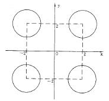

# 1.水题   

[TOC]   

## 出租车费   
>**Description:** 西安出租车的收费标准：起步价（2公里以内，含2公里）为7元钱，超过2公里且在15公里以内（含15公里）时每公里收费1.5元，超过15公里时每公里收费2.1元，不足1公里按照1公里收费。   
>**Input:** 输入为实型(单位为公里)   
>**Output:** 输出为实型，保留六位小数(单位为元)   
>**Sample Input:** 9.2   
>**Sample Output:** 19.000000   

```C
#include <stdio.h> 

int main() {
    double miles;
    double tax_fee = 0.0;

    scanf("%lf", &miles);

    if (miles <= 2.0) {
        tax_fee = 7.0;
    } else if (miles > 2.0 && miles <= 15.0) {
        // 对公里数进行取整
        if ((miles - (int)miles) > 1e-6) {
            miles = (int)miles + 1;
        } else {
            miles = (int)miles;
        }
        tax_fee = 7.0 + 1.5 * (miles - 2);
    } else if (miles > 15) {
         // 对公里数进行取整
        if ((miles - (int)miles) > 1e-6) {
            miles = (int)miles + 1;
        } else {
            miles = (int)miles;
        }
        tax_fee = 7.0 + 1.5 * 13 + (miles - 15) * 2.1;
    }

    printf("%.6lf", tax_fee);
    return 0;
}
```


## 圆及圆球等的相关计算   
>**Description:** 输入圆半径r和圆柱高h，计算圆周长l、圆面积s、圆球表面积sq、圆球体积vq和圆柱体积vz   
>**Input:** 输入实型，用空格分隔   
>**Output:** 按顺序输出圆周长、圆面积、圆球表面积、圆球体积、圆柱体积，保留2位小数，结果每行输出一个   
>**Sample Input:** 1.5 3   
>**Sample Output:** 9.42
7.07
28.27
14.14
21.21   

```C
#include <stdio.h>

const double pi = 3.1415926;

int main() {
    double radius, height;
    scanf("%lf %lf", &radius, &height);
    double perimeter = 2.0 * pi * radius; // 圆周长
    double area = pi * radius * radius; // 圆面积
    double superficial_area = 4.0 * pi * radius * radius; // 圆球表面积
    double volume = 4.0 / 3.0 * pi * radius * radius * radius; // 圆球体积
    double bulk = area * height; // 圆柱体积
    printf("%.2lf\n%.2lf\n%.2lf\n%.2lf\n%.2lf\n", perimeter, area, superficial_area, volume, bulk);
    return 0;
}
```

## 奖金发放   
>**Description:** 企业发放的奖金根据利润提成。利润(I)低于或等于10万元时，奖金可提10%；利润高于10万元，低于20万元时，低于10万元的部分按10%提成，高于10万元的部分，可提成7.5%；20万到40万之间时，高于20万元的部分，可提成5%；40万到60万之间时高于40万元的部分，可提成3%；60万到100万之间时，高于60万元的部分，可提成1.5%，高于100万元时，超过100万元的部分按1%提成，从键盘输入当月利润I，求应发放奖金总数？   
>**Input:** 输入为实型(单位为万元)   
>**Output:** 输出为实型，保留六位小数(单位为万元)   
>**Sample Input:** 35   
>**Sample Output:** 2.500000   

```C
#include <stdio.h>

int main() {
    double profit;
    scanf("%lf", &profit);
    double bonus = 0.0;
    // 按区间进行发放奖金，在一定区间内奖金数一定

    double ten = 10.0 * 0.1;
    double ten_to_twenty = 10.0 * 0.075;
    double twenty_to_forty = 20.0 * 0.05;
    double forty_to_sixty = 20.0 * 0.03;
    double sixty_to_hundred = 40.0 * 0.015;

    if (profit <= 10.0) {
        bonus = profit * 0.1;
    } else if (profit > 10 && profit <= 20) {
        bonus = ten + (profit - 10.0) * 0.075;
    } else if (profit > 20 && profit <= 40) {
        bonus = ten + ten_to_twenty + (profit - 20.0) * 0.05;
    } else if (profit > 40 && profit <= 60) {
        bonus = ten + ten_to_twenty + twenty_to_forty + (profit - 40.0) * 0.03;
    } else if (profit > 60 && profit <= 100) {
        bonus = ten + ten_to_twenty + twenty_to_forty + forty_to_sixty + (profit - 60.0) * 0.015;
    } else if (profit > 100) {
        bonus = ten + ten_to_twenty + twenty_to_forty + forty_to_sixty + sixty_to_hundred +(profit - 100.0) * 0.01;
    }

    printf("%.6lf", bonus);

    return 0;
}
```

## 成绩转换   
>**Description:** 百分制成绩转换为五分制成绩，转换规则为：90～100：A；80～89：B；70～79：C；60～69：D；60分以下：E。输入百分制成绩，输出对应的五分制成绩。   
>**Input:** 输入为整型   
>**Output:** 输出为字符型   
>**Sample Input:** 87   
>**Sample Output:** B   

```C
#include <stdio.h>

int main() {
    int score;
    char level;
    scanf("%d", &score);
    if (score >= 90 && score <= 100) {
        level = 'A';
    } else if (score >= 80 && score < 90) {
        level = 'B';
    } else if (score >= 70 && score < 80) {
        level = 'C';
    } else if (score >= 60 && score < 70){
        level = 'D';
    } else {
        level = 'B';
    }

    printf("%c\n", level);
    return 0;
}
```


## 找幸运数   
>**Description:** 如果一个整数逆序后得到的数值和原数值相同，则称之为幸运数。输入一个整数N（N＜100000）判断是否为幸运数，是的话输出”yes”，否则输出”no”。   
>**Input:** 输入一个整数   
>**Output:** 输出为字符串   
>**Sample Input:** 1234   
>**Sample Output:** no   

```C
#include <stdio.h>

int main() {
    int num;
    scanf("%d", &num);
    if (num <= 10) {
        printf("no\n");
    } else {
        // 取数字num的后一半，相当于将一个数从中间切开，如果对称，那么就是幸运数
        int reverse_num = 0;
        while (reverse_num < num) {
          reverse_num = reverse_num * 10 + num % 10;
          num = num / 10;
        }

        if (reverse_num > num) {
            reverse_num = reverse_num / 10;
        }

        if (reverse_num == num) {
            printf("yes\n");
        } else {
            printf("no\n");
        }
    }
    return 0;
}
```


## 找最大数   
>**Description:** 找出三个数据A，B，C中的最大数   
>**Input:** 输入为整型，用空格分隔   
>**Output:** 输出为整型   
>**Sample Input:** 100 29 712   
>**Sample Output:** 712   

```C
#include <stdio.h>

int main() {
    int a, b, c;
    scanf("%d %d %d", &a, &b, &c);
    int temp = a > b ? a : b;
    c = temp > c ? temp : c;
    printf("%d\n", c);
    return 0;
}
```


## 是该年的第几天？   
>**Description:** 输入一个日期(YYYY-MM-DD)输入一个日期，判断是这一年的第几天？   
>**Input:** 输入为整型，以”-”隔开   
>**Output:** 输出为整型   
>**Sample Input:** 2013-6-17   
>**Sample Output:** 168   
```C
#include <stdio.h>

// 设置每月的天数，有平年与闰年之分
const int day_of_month[12][2] = {
    {31, 31}, //一月
    {28, 29}, // 二月
    {31, 31}, // 三月
    {30, 30}, // 四月
    {31, 31}, // 五月
    {30, 30}, // 六月
    {31, 31}, // 七月
    {31, 31}, // 八月
    {30, 30}, // 九月
    {31, 31}, //十月
    {30, 30}, //十一月
    {31, 31} //十二月
};

int main() {
    int year, month, day;
    int days = 0;
    scanf("%d-%d-%d", &year, &month, &day);

    // 判断是否为闰年
    int flag = (year % 400 == 0 || (year % 100 != 0 && year % 4 == 0)) ? 1 : 0;

    for (int i = 0; i < month - 1; i++) {
        days += day_of_month[i][flag];
    }
    days += day;
    printf("%d\n", days);
    return 0;
}
```


## 求建筑高度   
>**Description:** 有4个圆塔，圆心分别为(2，2)、(-2，2)、(2，-2)、(-2，-2)，圆半径为1。这4个塔的高度为10m。塔以外无建筑物。请编写程序，输入任一点的坐标，求该点的建筑高度(塔外的高度为零)。   
>   
>**Input:** 输入为实型，以”,”隔开   
>**Output:** 输出为整型   
>**Sample Input:** 2,2.5   
>**Sample Output:** 10   

```C
#include <stdio.h>

const double center[4][2] = {
    {2, 2},
    {-2, 2},
    {2, -2},
    {-2, -2}
};

int main() {
    double x, y;
    scanf("%lf,%lf", &x, &y);
    int flag = 1;
    
    // 判断距离圆心的距离， 在圆内flag为1， 否则为0
    for (int i = 0; i < 4; i++) {
        double distance = (x - center[i][0]) * (x - center[i][0]) + (y - center[i][1]) * (y - center[i][1]);
        if (distance > 1.0) {
            flag = 0;
            continue;
        } else {
            flag = 1;
            break;
        }
    }

    if (flag == 0) {
        printf("0\n");
    } else {
        printf("10\n");
    }

    return 0;

}
```


## 计算A+B   
>**Description:** 计算A+B   
>**Input:** 输入整数A和整数B的值，用空格隔开   
>**Output:** 输出A+B的结果   
>**Sample Input:** 1 2   
>**Sample Output:** 3   

```C
#include <stdio.h>
int main() {
    int a, b;
    scanf("%d %d", &a, &b);
    printf("%d\n", a + b);
    return 0;
}
```


## 计算成绩   
>**Description:** 输入某学生的数学、英语和C语言课程成绩，输出该学生三门课总成绩和平均成绩   
>**Input:** 输入为实型，用空格分隔   
>**Output:** 输出为实型，保留六位小数，结果每行输出一个   
>**Sample Input:** 90 82 74   
>**Sample Output:** 246.000000
82.000000   

```C
#include <stdio.h>

int main() {
    float math, english, c;
    scanf("%f %f %f", &math, &english, &c);
    float sum = math + english + c;
    float average = sum / 3.0;
    printf("%.6f\n%.6f\n", sum, average);
    return 0;
}
```

