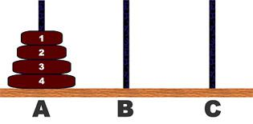
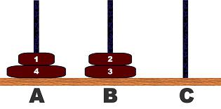
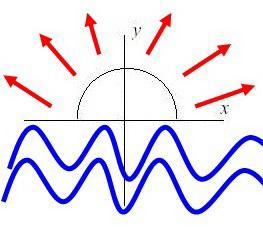
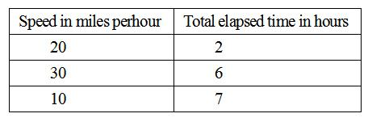

# 10.挑战ACM-ICPC   

[TOC]   

## Arithmetic Progressions   
>**Description:** If a and d are relatively prime positive integers, the arithmetic sequence beginning with a and increasing by d, i.e., a, a + d, a + 2d, a + 3d, a + 4d, ..., contains infinitely many prime numbers. This fact is known as Dirichlet's Theorem on Arithmetic Progressions, which had been conjectured by Johann Carl Friedrich Gauss (1777 - 1855) and was proved by Johann Peter Gustav Lejeune Dirichlet (1805 - 1859) in 1837.For example, the arithmetic sequence beginning with 2 and increasing by 3, i.e.,    2, 5, 8, 11, 14, 17, 20, 23, 26, 29, 32, 35, 38, 41, 44, 47, 50, 53, 56, 59, 62, 65, 68, 71, 74, 77, 80, 83, 86, 89, 92, 95, 98, ... ,contains infinitely many prime numbers    2, 5, 11, 17, 23, 29, 41, 47, 53, 59, 71, 83, 89, ... .Your mission, should you decide to accept it, is to write a program to find the nth prime number in this arithmetic sequence for given positive integers a, d, and n.   
>**Input:** The input is a sequence of datasets. A dataset is a line containing three positive integers a, d, and n separated by a space. a and d are relatively prime. You may assume a <= 9307, d <= 346, and n <= 210.   
>**Output:** The output should be composed of as many lines as the number of the input datasets. Each line should contain a single integer and should never contain extra characters.   
>**Sample Input:** 367 186 151
179 10 203
271 37 39
103 230 1
0 0 0   
>**Sample Output:** 92809
6709
12037
103   

## Bee   
>**Description:** In Africa there is a very special species of bee. Every year, the female bees of such species give birth to one male bee, while the male bees give birth to one male bee and one female bee, and then they die!Now scientists have accidentally found one "magical female bee" of such special species to the effect that she is immortal, but still able to give birth once a year as all the other female bees. The scientists would like to know how many bees there will be after N years. Please write a program that helps them find the number of male bees and the total number of all bees after N years.   
>**Input:** Each line of input contains an integer N (≥ 0). Input ends with a case where N = -1. (This case should NOT be processed.)    
>**Output:** Each line of output should have two numbers, the first one being the number of male bees after N years, and the second one being the total number of bees after N years. (The two numbers will not exceed 2e+32.)    
>**Sample Input:** 1
3
-1   
>**Sample Output:** 1 2
4 7   

## Checksum algorithm   
>**Description:** A checksum is an algorithm that scans a packet of data and returns a single number. The idea is that if the packet is changed, the checksum will also change, so checksums are often used for detecting transmission errors, validating document contents, and in many other situations where it is necessary to detect undesirable changes in data.For this problem, you will implement a checksum algorithm called Quicksum. A Quicksum packet allows only uppercase letters and spaces. It always begins and ends with an uppercase letter. Otherwise, spaces and letters can occur in any combination, including consecutive spaces.A Quicksum is the sum of the products of each character's position in the packet times the character's value. A space has a value of zero, while letters have a value equal to their position in the alphabet. So, A=1, B=2, etc., through Z=26. Here are example Quicksum calculations for the packets "ACM" and "MID CENTRAL":ACM: 1*1  + 2*3 + 3*13 = 46MID CENTRAL: 1*13 + 2*9 + 3*4 + 4*0 + 5*3 + 6*5 + 7*14 + 8*20 + 9*18 + 10*1 + 11*12 = 650   
>**Input:** The input consists of one or more packets followed by a line containing only # that signals the end of the input. Each packet is on a line by itself, does not begin or end with a space, and contains from 1 to 255 characters.   
>**Output:** For each packet, output its Quicksum on a separate line in the output.   
>**Sample Input:** ACM
MID CENTRAL
REGIONAL PROGRAMMING CONTEST
ACN
A C M
ABC
BBC
`#`   
>**Sample Output:** 46
650
4690
49
75
14
15   

## Dexter need help   
>**Description:** Dexter is tired of Dee Dee. So he decided to keep Dee Dee busy in a game. The game he planned for her is quite easy to play but not easy to win at least not for Dee Dee. But Dexter does not have time to spend on this silly task, so he wants your help.There will be a button, when it will be pushed a random number N will be chosen by computer. Then on screen there will be numbers from 1 to N. Dee Dee can choose any number of numbers from the numbers on the screen, and then she will command computer to subtract a positive number chosen by her (not necessarily on screen) from the selected numbers. Her objective will be to make all the numbers 0.For example if N = 3, then on screen there will be 3 numbers on screen: 1, 2, 3. Say she now selects 1 and 2. Commands to subtract 1, then the numbers on the screen will be: 0, 1, 3. Then she selects 1 and 3 and commands to subtract 1. Now the numbers are 0, 0, 2. Now she subtracts 2 from 2 and all the numbers become 0.Dexter is not so dumb to understand that this can be done very easily, so to make a twist he will give a limit L for each N and surely L will be as minimum as possible so that it is still possible to win within L moves. But Dexter does not have time to think how to determine L for each N, so he asks you to write a code which will take N as input and give L as output.   
>**Input:** Input consists of several lines each with N such that 1 ≤ N ≤ 1,000,000,000. The end of the input is indicated by a zero.   
>**Output:** For each N output L in separate lines.   
>**Sample Input:** 1
2
3
0   
>**Sample Output:** 1
2
2   

## Double   
>**Description:** As part of an arithmetic competency program, your students will be given randomly generated lists of from 2 to 15 unique positive integers and asked to determine how many items in each list are twice some other item in the same list. You will need a program to help you with the grading. This program should be able to scan the lists and output the correct answer for each one. For example, given the list1 4 3 2 9 7 18 22your program should answer 3, as 2 is twice 1, 4 is twice 2, and 18 is twice 9.   
>**Input:** There will be one list of numbers per line. Each list will contain from 2 to 15 unique positive integers. No integer will be larger than 99. Each line will be terminated with the integer 0, which is not considered part of the list.   
>**Output:** The output contain a count of the items that are double some other item.    
>**Sample Input:** 1 4 3 2 9 7 18 22 0   
>**Sample Output:** 3   

## Favorite number   
>**Description:** HanBo Favorite number is 1, So he will often use some ways to put some numbers to 1,and to this endless pride.He would only two ways will be:(1) Put a number m divided by a prime number p . of course, this number must be divisible, i.e m = m / p(2) The number m of one minus 1, i.e m = m-1There are a whim, he wanted [a, b] interval all the numbers one by one into a 1, which is a huge boring works, so he wanted to know how much he was operating at least in order to achieve the purpose.   
>**Input:** Input contains multiple sets of data (1000 data), the end of the input is indicated by 0 0.   
>**Output:** Each data output line, at least operand numbers.   
>**Sample Input:** 2 3
3 5
11 12
0 0   
>**Sample Output:** 2
4
3   

## Graveyard   
>**Description:** Programming contests became so popular in the year 2397 that the governor of New Earck — the largest human-inhabited planet of the galaxy — opened a special Alley of Contestant Memories (ACM) at the local graveyard. The ACM encircles a green park, and holds the holographic statues of famous contestants placed equidistantly along the park perimeter. The alley has to be renewed from time to time when a new group of memorials arrives.When new memorials are added, the exact place for each can be selected arbitrarily along the ACM, but the equidistant disposition must be maintained by moving some of the old statues along the alley.Surprisingly, humans are still quite superstitious in 24th century: the graveyard keepers believe the holograms are holding dead people souls, and thus always try to renew the ACM with minimal possible movements of existing statues (besides, the holographic equipment is very heavy). Statues are moved along the park perimeter. Your work is to find a renewal plan which minimizes the sum of travel distances of all statues. Installation of a new hologram adds no distance penalty, so choose the places for newcomers wisely!   
>**Input:** Input file contains two integer numbers: n — the number of holographic statues initially located at the ACM, and m — the number of statues to be added (2 ≤ n ≤ 1000, 1 ≤ m ≤ 1000). The length of the alley along the park perimeter is exactly 10 000 feet.Te end of the input is indicated by 0 0.   
>**Output:** Write a single real number to the output file — the minimal sum of travel distances of all statues (in feet). The answer must be precise to at least 4 digits after decimal point.   
>**Sample Input:** 2 1
2 3
0 0   
>**Sample Output:** 1666.6667
1000.0000   

## Hanoi II   
>**Description:** The (Three peg) Tower of Hanoi problem is a popular one in computer science. Briefly the problem is to transfer all the disks from peg-A to peg-C using peg-B as intermediate one in such a way that at no stage a larger disk is above a smaller disk. Normally, we want the minimum number of moves required for this task. The problem is used as an ideal example for learning recursion. It is so well studied that one can find the sequence of moves for smaller number of disks such as 3 or 4. A trivial computer program can find the case of large number of disks also.Here we have made your task little bit difficult by making the problem more flexible. Here the disks can be in any peg initially. If more than one disk is in a certain peg, then they will be in a valid arrangement (larger disk will not be on smaller ones). We will give you two such arrangements of disks. You will have to find out the minimum number of moves, which will transform the first arrangement into the second one. Of course you always have to maintain the constraint that smaller disks must be upon the larger ones.    
>   
   
>**Input:** The input file contains at most 100 test cases. Each test case starts with a positive integer N ( 1≤N≤60), which means the number of disks. You will be given the arrangements in next two lines. Each arrangement will be represented by N integers, which are 1, 2 or 3. If the i-th ( 1≤i≤N) integer is 1, you should consider that i-th disk is on Peg-A. The end of the input is indicated by a zero.. This case should not be processed.    
>**Output:** Output of each test case should consist of a line starting with `Case #: ' where # is the test case number. It should be followed by the minimum number of moves as specified in the problem statement.    
>**Sample Input:** 3
1 1 1
2 2 2
3
1 2 3
3 2 1
0   
>**Sample Output:** 7
3   

## Houseboat   
>**Description:** Fred Mapper is considering purchasing some land in Louisiana to build his house on. In the process of investigating the land, he learned that the state of Louisiana is actually shrinking by 50 square miles each year, due to erosion caused by the Mississippi River. Since Fred is hoping to live in this house the rest of his life, he needs to know if his land is going to be lost to erosion.After doing more research, Fred has learned that the land that is being lost forms a semicircle(Red). This semicircle is part of a circle centered at (0,0), with the line that bisects the circle being the X axis. Locations below the X axis are in the water(Blue). The semicircle has an area of 0 at the beginning of year 1. (Semicircle illustrated in the Figure.)    
>   
>**Input:** The first line of input will be a positive integer indicating how many data sets will be included (N). Each of the next N lines will contain the X and Y Cartesian coordinates of the land Fred is considering. These will be floating point numbers measured in miles. The Y coordinate will be non-negative. (0,0) will not be given.   
>**Output:** For each data set, a single line of output should appear. This line should take the form of: “ N Z” Where N is the data set (counting from 1), and Z is the first year (start from 1) this property will be within the semicircle AT THE END OF YEAR Z. Z must be an integer.    
>**Sample Input:** 2
1.0 1.0
25.0 0.0   
>**Sample Output:** 1 1
2 20   

## Redistribute wealth   
>**Description:** A Communist regime is trying to redistribute wealth in a village. They have have decided to sit everyone around a circular table. First, everyone has converted all of their properties to coins of equal value, such that the total number of coins is divisible by the number of people in the village. Finally, each person gives a number of coins to the person on his right and a number coins to the person on his left, such that in the end, everyone has the same number of coins. Given the number of coins of each person, compute the minimum number of coins that must be transferred using this method so that everyone has the same number of coins.    
>**Input:** There is a number of inputs. Each input begins with n(n<1000001), the number of people in the village. n lines follow, giving the number of coins of each person in the village, in counterclockwise order around the table. The total number of coins will fit inside an unsigned 64 bit integer.    
>**Output:** For each input, output the minimum number of coins that must be transferred on a single line.    
>**Sample Input:** 3
100
100
100
4
1
2
5
4
0   
>**Sample Output:** 0
4   

## Road trip   
>**Description:** Bill and Ted are taking a road trip. But the odometer in their car is broken, so they don't know how many miles they have driven. Fortunately, Bill has a working stopwatch, so they can record their speed and the total time they have driven. Unfortunately, their record keeping strategy is a little odd, so they need help computing the total distance driven. You are to write a program to do this computation.For example, if their log showsthis means they drove 2 hours at 20 miles per hour, then 6-2=4 hours at 30 miles per hour, then 7-6=1 hour at 10 miles per hour. The distance driven is then (2)(20) + (4)(30) + (1)(10) = 40 + 120 + 10 = 170 miles. Note that the total elapsed time is always since the beginning of the trip, not since the previous entry in their log.    
>   
>**Input:** The input consists of one or more data sets. Each set starts with a line containing an integer n, 1 <= n <= 10, followed by n pairs of values, one pair per line. The first value in a pair, s, is the speed in miles per hour and the second value, t, is the total elapsed time. Both s and t are integers, 1 <= s <= 90 and 1 <= t <= 12. The values for t are always in strictly increasing order. A value of -1 for n signals the end of the input.    
>**Output:** For each input set, print the distance driven   
>**Sample Input:** 3
20 2
30 6
10 7
2
60 1
30 5
-1   
>**Sample Output:** 170
180   

## Scoring   
>**Description:** Judging a programming contest is hard work, with demanding contestants, tedious decisions,and monotonous work. Not to mention the nutritional problems of spending 12 hours with only donuts, pizza, and soda for food. Still, it can be a lot of fun.Software that automates the judging process is a great help, but the notorious unreliability of some contest software makes people wish that something better were available. You are part of a group trying to develop better, open source, contest management software, based on the principle of modular design.Your component is to be used for calculating the scores of programming contest teams and determining a winner. You will be given the results from several teams and must determine the winner.ScoringThere are two components to a team's score. The first is the number of problems solved. The second is penalty points, which reflects the amount of time and incorrect submissions made before the problem is solved. For each problem solved correctly, penalty points are charged equal to the time at which the problem was solved plus 20 minutes for each incorrect submission. No penalty points are added for problems that are never solved.So if a team solved problem one on their second submission at twenty minutes, they are charged 40 penalty points. If they submit problem 2 three times, but do not solve it, they are charged no penalty points. If they submit problem 3 once and solve it at 120 minutes, they are charged 120 penalty points. Their total score is two problems solved with 160 penalty points.The winner is the team that solves the most problems. If teams tie for solving the most problems,then the winner is the team with the fewest penalty points.   
>**Input:** For the programming contest your program is judging, there are four problems. You are guaranteed that the input will not result in a tie between teams after counting penalty points.   
>**Output:** The output consists of a single line listing the name of the team that won, the number of problems they solved, and their penalty points.   
>**Sample Input:** 4
Stars 2 20 5 0 4 190 3 220
Rockets 5 180 1 0 2 0 3 100
Penguins 1 15 3 120 1 300 4 0
Marsupials 9 0 3 100 2 220 3 80   
>**Sample Output:** Penguins 3 475   

## Specialized Numbers   
>**Description:** Find and list all four-digit numbers in decimal notation that have the property that the sum of its four digits equals the sum of its digits when represented in hexadecimal (base 16) notation and also equals the sum of its digits when represented in duodecimal (base 12) notation.For example, the number 2991 has the sum of (decimal) digits 2+9+9+1 = 21. Since 2991 = 1*1728 + 8*144 + 9*12 + 3, its duodecimal representation is 189312, and these digits also sum up to 21. But in hexadecimal 2991 is BAF16, and 11+10+15 = 36, so 2991 should be rejected by your program.The next number (2992), however, has digits that sum to 22 in all three representations (including BB016), so 2992 should be on the listed output. (We don't want decimal numbers with fewer than four digits -- excluding leading zeroes -- so that 2992 is the first correct answer.)    
>**Input:** There is no input for this problem   
>**Output:** Your output is to be 2992 and all larger four-digit numbers that satisfy the requirements (in strictly increasing order), each on a separate line with no leading or trailing blanks, ending with a new-line character. There are to be no blank lines in the output. The first few lines of the output are shown below.   
>**Sample Input:** None   
>**Sample Output:** 2992
2993
2994
…   

## Sticks   
>**Description:** George took sticks of the same length and cut them randomly until all parts became at most 50 units long. Now he wants to return sticks to the original state, but he forgot how many sticks he had originally and how long they were originally. Please help him and design a program which computes the smallest possible original length of those sticks. All lengths expressed in units are integers greater than zero.    
>**Input:** The input contains blocks of 2 lines. The first line contains the number of sticks parts after cutting, there are at most 64 sticks. The second line contains the lengths of those parts separated by the space. The last line of the file contains zero.   
>**Output:** The output should contains the smallest possible length of original sticks, one per line.    
>**Sample Input:** 9
5 2 1 5 2 1 5 2 1
4
1 2 3 4
0   
>**Sample Output:** 6
5   

## Sum of Consecutive   
>**Description:** Some positive integers can be represented by a sum of one or more consecutive prime numbers. How many such representations does a given positive integer have? For example, the integer 53 has two representations 5 + 7 + 11 + 13 + 17 and 53. The integer 41 has three representations 2+3+5+7+11+13, 11+13+17, and 41. The integer 3 has only one representation, which is 3. The integer 20 has no such representations. Note that summands must be consecutive primenumbers, so neither 7 + 13 nor 3 + 5 + 5 + 7 is a valid representation for the integer 20.Your mission is to write a program that reports the number of representations for the given positive integer.   
>**Input:** The input is a sequence of positive integers each in a separate line. The integers are between 2 and 10 000, inclusive. The end of the input is indicated by a zero.   
>**Output:** The output should be composed of lines each corresponding to an input line except the last zero. An output line includes the number of representations for the input integer as the sum of one or more consecutive prime numbers. No other characters should be inserted in the output.   
>**Sample Input:** 2
17
41
20
666
0   
>**Sample Output:** 1
2
3
0
0   

