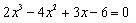
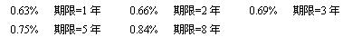
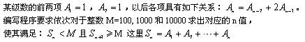
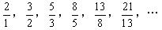
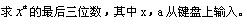
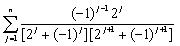
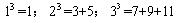
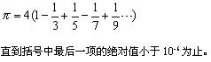

# 2.循环   

[TOC]   

## VOL大学乒乓球比赛   
>**Description:** VOL大学有两个乒乓球队进行比赛，各出3人。甲队为A、B、C三人，乙队为X、Y、Z三人，已抽签决定比赛名单，有人向队员打听比赛的名单，A说他不和X比，C说他不和X、Z比，请编写程序找出3对赛手的名单。   
>**Input:** None   
>**Output:** 输出赛手名单，一行一对。   
>**Sample Input:** None   
>**Sample Output:** A=Z
B=X
C=Y   

```C
#include <stdio.h>

int main() {
    char a, b, c;
    // 暴力遍历，穷举所以的可能性
    for (a = 'X'; a <= 'Z'; a++) {
        for (b = 'X'; b <= 'Z'; b++) {
            if (a != b) {
                for (c = 'X'; c <= 'Z'; c++) {
                    // 判断条件
                    if (a != c && b != c && a != 'X' && c != 'X' && c!= 'Z') {
                        printf("A=%c\nB=%c\nC=%c\n", a, b, c);
                    }
                }
            }
        }
    }
    return 0;
}
```


## 两个整数之间所有的素数   
>**Description:** 编写程序，求任意两个整数之间所有的素数。   
>**Input:** 输入两个整数，用空格间隔。注意输入的两个整数谁大谁小是任意的。   
>**Output:** 输出数据占一行，用空格间隔。   
>**Sample Input:** 100 130   
>**Sample Output:** 101 103 107 109 113 127   

```C
#include <stdio.h>
#include <math.h>

int isPrime(int num) {
    if (num <= 1) return 0;
    for (int i = 2; i <= sqrt(num); i++) {
        if (num % i == 0) return 0;
        else {
            continue;
        }
    }
    return 1;
}

int main() {
    int min, max;
    scanf("%d %d", &min, &max);
    
    if (min > max) {
        int temp = min;
        min = max;
        max = temp;
    }

    for (int i = min; i <= max; i++) {
        if (isPrime(i)) {
            printf("%d ", i);
        }
    }
    printf("\n");

    return 0;

}
```

## 二分求根   
>**Description:** 请编写程序，用二分法求下面方程在(－10，10)之间的根：   
>   
>**Input:** 输入区间数据为实型、用空格隔开输出均。   
>**Output:** 输出根为实型，保留两位小数。   
>**Sample Input:** -10 10   
>**Sample Output:** 2.00   

```C
#include <stdio.h>

//  取绝对值
double fabs(double temp) {
    if (temp > 0) {
        return temp;
    } else {
        return -1.0 * temp;
    }
}

// 设置误差
const double delta = 1e-6;


// 计算方程的值
double function_result(double x) {
    return 2.0 * x * x * x - 4.0 * x * x + 3.0 * x - 6.0; 
}

int main() {
    double begin = -10;
    double end = 10;
    double mid = begin + (end - begin) / 2.0;

    double mid_result = function_result(mid);

    // 二分求解
    while (fabs(mid_result) > delta) {
        double begin_result = function_result(begin);
        if (begin_result * mid_result > 0) {
            begin = mid;
        } else {
            end = mid;
        }
        mid = begin + (end - begin) / 2.0;
        mid_result = function_result(mid);
    }

    printf("%.2lf\n", mid);

    return 0;
}

```

## 五猴分桃   
>**Description:** 5只猴子一起摘了1堆桃子。因为太累了，它们商量决定，先睡一觉再分。过了不知多久，1只猴子来了。它见别的猴子没来，便将这1堆桃子平均分成5份，结果多了1个，就将多的这个吃了，拿走其中的1堆。又过了不知多久，第2只猴子来了。它不知道有1个同伴已经来过，还以为自己是第1个到的呢。于是将地上的桃子堆起来，平均分成5份，发现也多了1个，同样吃了这1个，拿走其中的1堆。第3只、第4只、第5只猴子都是这样……问这5只猴子至少摘了多少个桃子？第5个猴子走后还剩下多少个桃子？   
>**Input:** None   
>**Output:** 输出5只猴子至少摘了多少个桃子，第5个猴子走后还剩下多少个桃子。中间用空格隔开。   
>**Sample Input:** None   
>**Sample Output:** 3121 1020   

如果对于有n只猴子，每次第一次给的少了1个桃子，假设有$x$个桃子，如果刚好有$x+4$个桃子就够分了，所以第一个分完后有$\frac{4}{5}(x+4)$，则下一只猴子来分剩下的桃子后，剩下的桃子数为$(\frac{4}{5}) ^2(x+4)$, 所以有$n$只猴子来分的话，就会剩下$(\frac{4}{5} ^n)(x+4)$，所以要保证剩下的桃子的个数是整数，则$(x+4) = 5^n$， 可得$x = 5^n - 4$， 剩下的桃子为$(\frac{4}{5})^n(x+4) - 4$，减4是因为4是前面加上去的，所以带入得剩下的桃子个数为$4^n - 4$

```C
#include <stdio.h>

int main() {
    int monkey_num = 5;
    int peach_num = 1;
    int left_peach = 1;
    int temp = monkey_num;
    while (temp != 0) {
        peach_num = 5 * peach_num;
        temp--;
    }
    peach_num -= 4;

    temp = monkey_num;

    while (temp != 0) {
        left_peach = 4 * left_peach;
        temp--;
    }
    left_peach = left_peach - 4;

    printf("%d %d\n", peach_num, left_peach);

    return 0;

}
```


## 你会存钱吗？   
>**Description:** 假设银行整存整取存款不同期限的月息利率分别为：利息=本金*月息利率*12*存款年限。现在某人手中有2000元钱，请通过计算选择一种存钱方案，使得钱存入银行20年后得到的利息最多（假定银行对超过存款期限的那一部分时间不付利息）。   
>   
>**Input:** None   
>**Output:** 输出第1行为8年、5年、3年、2年、1年的存款方案（各利率存款次数），用空格隔开。输出第2行为最大收益。   
>**Sample Input:** None   
>**Sample Output:** 0 4 0 0 0
8841.01   

```C
#include <stdio.h>

// 采用快速求幂法求base^exponent
double pow(double base, int exponent) {
    double result = 1.0;
    while (exponent != 0) {
        if (exponent % 2 != 0) {
            result *= base;
        }
        base *= base;
        exponent /= 2;
    }
    return result;
}


// 记录存钱年份的利率
const double one_interest = 0.0063 * 12 * 1;
const double two_interest = 0.0066 * 12 * 2;
const double three_interest = 0.0069 * 12 * 3;
const double five_interest = 0.0075 * 12 * 5;
const double eight_interest = 0.0084 * 12 * 8;
 
int main() {
    double capital = 2000.0; // 本金
    double capital_and_interest = 2000.0; // 本金加利息
    int years[5] = {0};
    int total_year = 20;

    for (int i = 0; i <= total_year / 8; i++) {
        for (int j = 0; j <= (total_year - i * 8) / 5; j++) {
            for (int k = 0; k <= (total_year - i * 8 -j * 5) / 3; k++) {
                for (int m = 0; m <= (total_year - i * 8 - j * 5 - k * 3) / 2; m++) {
                    int n = total_year - i * 8 - j * 5 - k * 3 - m * 2;
                    double temp = capital 
                                * pow(1.0 + one_interest, n)
                                * pow(1.0 + two_interest, m)
                                * pow(1.0 + three_interest, k)
                                * pow(1.0 + five_interest, j)
                                * pow(1.0 + eight_interest, i);                                ;
                    if (temp >= capital_and_interest) {
                        capital_and_interest = temp;
                        years[0] = i;
                        years[1] = j;
                        years[2] = k;
                        years[3] = m;
                        years[4] = n;
                    }
                }
            }
        }
    }

    for (int i = 0; i < 5; i++) {
        printf("%d ", years[i]);
    }
    printf("\n%.2f\n", capital_and_interest);
    return 0;

}
```


## 区间内素数   
>**Description:** 编写程序计算500～800区间内素数的个数cnt，并按所求素数的值从大到小的顺序，再计算其间隔减、加之和，即第1个素数－第2个素数+第3个素数－第4个素数+第5个素数……的值sum。   
>**Input:** None   
>**Output:** 一行内输出cnt和sum，用空格隔开。   
>**Sample Input:** None   
>**Sample Output:** 44 130   

```C
#include <stdio.h>
#include <math.h>

/**
 * 判断n是否为素数，如果是返回1，不是返回0
 */
int is_prime(int n) {
    for (int i = 2; i <= sqrt(n); i++) {
        if (n % i == 0) {
            return 0;
        } else {
            continue;
        }
    }
    return 1;
}

int main() {
    int begin_interval = 500; // 开始区间
    int end_interval = 800; // 结束区间
    int prime[200]; // 保存素数
    int count = 0; // 确定素数个数

    // 寻找个数
    for (int i = begin_interval; i <= end_interval; i++) {
        if (is_prime(i)) {
            prime[count] = i;
            count++;
        }
    }

    // 计算和
    int interval_sum = 0;
    int flag = 1; // 标识位，记录符号
    for (int i = count - 1; i > -1; i--) {
        if (flag == 1) {
            interval_sum += prime[i];
            flag = 0;
        } else {
            interval_sum -= prime[i];
            flag = 1;
        }
    }

    printf("%d %d", count, interval_sum);

    return 0;

}
```


## 多项式的猜想   
>**Description:**    
>   
>**Input:** None   
>**Output:** 输出三行对应的n值。   
>**Sample Input:** None   
>**Sample Output:** 6
9
11   

```C
#include <stdio.h>

const int length = 20;

// 返回值所在的数组索引
int get_index(int array[], int sum) {
    int temp_sum = 0;
    int i = 0;
    for (; i < length - 1; i++) {
        temp_sum += array[i];
        if (temp_sum < sum && temp_sum + array[i + 1] >= sum) {
            break;
        }
    }
    return i;
}

int main() {
    int a1 = 1, a2 = 1;
    int array[length];
    array[0] = 1;
    array[1] = 1;
    for (int i = 2; i < length; i++) {
        array[i] = array[i - 2] + 2 * array[i - 1];
    }

    printf("%d\n", get_index(array, 100) + 1);
    printf("%d\n", get_index(array, 1000) + 1);
    printf("%d\n", get_index(array, 10000) + 1);

    return 0;
}
```


## 奇特的分数数列   
>**Description:** 有一个分数数列：求出这个数列前20项之和。   
>   
>**Input:** None   
>**Output:** 输出保留六位小数。   
>**Sample Input:** None   
>**Sample Output:** 32.660261   

```C
#include <stdio.h>
#define SIZE  21

int main() {
    int fibonacci[SIZE]; // 分数数列中出现数字的特征为斐波那契数列
    fibonacci[0] = 1;
    fibonacci[1] = 2;
    for (int i = 2; i < SIZE; i++) {
        fibonacci[i] = fibonacci[i - 1] + fibonacci[i - 2];
    }

    double sum = 0.0;
    for (int i = 1; i < SIZE; i++) {
        sum += 1.0 * fibonacci[i] / fibonacci[i - 1];
    }

    printf("%.6lf\n", sum);

    return 0;

}
```

## 完全数   
>**Description:** 一个数如果恰好等于它的因子之和，这个数就称为"完数"。例如，6的因子为1、2、3，而6=1+2+3，因此6是"完数"。请编写程序，找出1000之内的所有完数。   
>**Input:** None   
>**Output:** 每行按格式输出其因子：6=1+2+3   
>**Sample Input:** None   
>**Sample Output:** 6=1+2+3
28=1+2+4+7+14
496=1+2+4+8+16+31+62+124+248   
```C
#include <stdio.h>

int main() {
    int max = 1000; 
    int factors[100]; // 记录每个数的因子
    int count = 0; // 记录因子的个数
    int temp = 0; // 将因子相加起来，记录一个数所有因子和

    // 开始遍历2～1000内的数字
    for (int i = 2; i <= max; i++) {
        // 记录每个数的因子
        for (int j = 1; j <= i / 2; j++) {
            if (i % j == 0) {
                factors[count] = j;
                count++;
                temp += j;
            }
        }

        // 验证并输出
        if (temp == i) {
            printf("%d=", i);
            for (int k = 0; k < count - 1; k++) {
                printf("%d+", factors[k]);
            }
            printf("%d\n", factors[count - 1]);
        }

        // 置0并进行下一个数的判断
        count = 0;
        temp = 0;
    }
}
```


## 整数位数   
>**Description:** 编写程序输入一个数，输出其整数部分的位数（例如输入123.4则输出3，输入－0.6则输出0）。   
>**Input:** 输入为实型。   
>**Output:** 输出为整型。   
>**Sample Input:** 123.4   
>**Sample Output:** 3   

```C
#include <stdio.h>

int main() {
    double num;
    scanf("%lf", &num);
    if (num < 0) {
        num = -num;
    }
    int count = 0;
    while (num >= 1) {
        count++;
        num = num / 10.0;
    }

    printf("%d\n", count);

    return 0;
}
```


## 最次方数   
>**Description:** 编写程序求一个整数的任意次方的最后三位数。即：   
>   
>**Input:** 输入均为整型，首先为x，其后为a，用空格隔开。   
>**Output:** 输出为整型。   
>**Sample Input:** 13 13   
>**Sample Output:** 253   

```C
#include <stdio.h>

int main() {
    int base, index;
    scanf("%d %d", &base, &index);

    int result = 1;
    while (index != 0) {
        result = result * base % 1000;
        index--;
    }

    printf("%d\n", result);

    return 0;
}
```


## 级数和   
>**Description:** 编写程序求下面级数前n项的和，其中n从键盘上输入。   
>   
>**Input:** 输入n为整型。   
>**Output:** 输出和为实型，保留六位小数。   
>**Sample Input:** 5   
>**Sample Output:** 0.338462   

```C
#include <stdio.h>

// 计算每一项的值
double caculate_element(int j) {
    int base = 1 << j; // 2的倍数可直接位移
    int append = 1;
    if (j % 2 != 0) {
        append = -1;
    }

    double result = (-1.0 * append * base) 
                    / (1.0 * (base + append)) 
                    / ((base << 1) + -1.0 * append);

    return result;
}

int main() {
    int n;
    scanf("%d", &n);

    double result = 0.0;
    while (n!= 0) {
        result += caculate_element(n);
        n--;
    }

    printf("%.6lf", result);

    return 0;
}
```


## 自然数立方的乐趣   
>**Description:** 编写程序验证下列结论：任何一个自然数n的立方都等于n个连续奇数之和。例如：要求程序对每个输入的自然数计算并输出相应的连续奇数。   
>   
>**Input:** 输入自然数n为整数。   
>**Output:** 输出n个连续奇数之和，格式如Sample Output显示。   
>**Sample Input:** 5   
>**Sample Output:** 5 * 5 * 5 = 125 = 21 + 23 + 25 + 27 + 29   

```C
#include <stdio.h>
#include <stdlib.h>

int main() {
    int n;
    scanf("%d", &n);
    int num = n * n * n;
    int size = num / 2 + 1;
    int *odds = malloc(size);
    for (int i = 0; i < size; i++) {
        odds[i] = 2 * i + 1;
    }

    int begin = 0;
    int end = 0;

    for (begin = 0; begin < size; begin++) {
        int sum = 0;
        for (end = begin; end < size; end++) {
            sum += odds[end];
            if (sum >= num) break;
        }
        if (sum == num) break;
    }

    printf("%d * %d * %d = %d = ", n, n, n, num);
    for (int i = begin; i < end; i++) {
        printf("%d + ", odds[i]);
    }
    printf("%d\n", odds[end]);

    return 0;
}

```

## 计算π   
>**Description:** 编写程序利用下面公式计算π的近似值：   
>   
>**Input:** None   
>**Output:** 输出π为实型，保留六位小数。   
>**Sample Input:** None   
>**Sample Output:** 3.141591   

```C
#include <stdio.h>

int main() {
    double pi = 0.0;
    double count = 1.0;
    int flag = 1;

    while ((1.0 / count) > 1e-6) {
        if (flag == 1) {
            pi = pi +  1.0 / count;
            flag = 0;
            count += 2.0;
        } else {
            pi = pi - 1.0 / count;
            flag = 1;
            count += 2.0;
        }
    }

    printf("%.6lf", pi * 4.0);

    return 0;
}
```


## 迭代求根   
>**Description:**    
>   
>**Input:** 输入a为实型   
>**Output:** 输出根为实型，保留五位小数。   
>**Sample Input:** 2   
>**Sample Output:** 1.41421   

```C
#include <stdio.h>
#include <math.h>

int main() {
    double a;
    double x, xn;
    double epsilon = 1e-5;
    scanf("%lf", &a);
    
    x = a;
    xn = 0.5 * (x + a / x);
    while (fabs(xn - x) > epsilon) {
        x = xn;
        xn = 0.5 * (x + a / x);
    }
    printf("%.5lf\n", xn);
    return 0;
}
```

