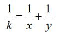
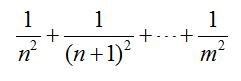
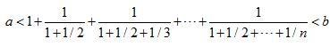

# 3.枚举   

[TOC]   

## “1”的传奇   
>**Description:** 计算1到N中数字“1”出现的个数，其中1≤N≤1000000000。   
>**Input:** 输入正整数N。   
>**Output:** 输出“1”出现的个数   
>**Sample Input:** 12   
>**Sample Output:** 5   

```C
#include <stdio.h>

// 计算1～num中含有x的个数
int count(int num, int x) {
    int times = 0;
    int temp = num;
    int base = 1;
    int high;

    // 从高位开始计算
    while (temp != 0) {
        high = temp / 10;
        // 最高不能为0
        if (x == 0) {
            if (high != 0) {
                high--;
            } else {
                break;
            }
        }

        times += high * base;

        int current = temp % 10;

        if (current > x) {
            times += base;
        } else if (current == x) {
            times += num - temp * base + 1;
        }

        base *= 10;
        temp = num / base;
    }

    return times;
}

int main() {
    int num;
    scanf("%d", &num);
    printf("%d\n", count(num, 1));
    return 0;
}
```


## 分数化小数   
>**Description:** 输入正整数a、b、c，输出a/b的小数形式，精确到小数点后c位。其中a、b≤1000000，c≤100。注意：本题有数据陷进。   
>**Input:** 输入正整数a、b、c，用空格隔开   
>**Output:** 输出计算结果，小数点后c位   
>**Sample Input:** 1 6 4   
>**Sample Output:** 0.1667   

```C
#include <stdio.h>

int main() {
    int a, b, digits;
    scanf("%d %d %d", &a, &b, &digits);
    // 多保留一位进行进位
    int num[digits + 2];

    num[0] = a / b;
    a = a % b;
    for (int i = 1; i <= digits + 1; i++) {
        num[i] = (a * 10) / b;
        a = (a * 10) % b;
    }

    // 进行四舍五入处理
    if (num[digits + 1] >= 5) {
        num[digits] += 1;
        for (int i = digits; i >= 1; i--) {
            if (num[i] == 10) {
                num[i] = 0;
                num[i - 1] += 1;
            }
        }
    }

    // 输出结果
    printf("%d.", num[0]);
    for (int i = 1; i <= digits; i++) {
        printf("%d", num[i]);
    }
    printf("\n");

    return 0;

}
```


## 分数拆分   
>**Description:** 输入正整数k，找出所有的正整数x≥y，使得   
>   
>**Input:** None   
>**Output:** None   
>**Sample Input:** 4   
>**Sample Output:** 1/4=1/20+1/5
1/4=1/12+1/6
1/4=1/8+1/8   


## 危险的组合   
>**Description:** 有一些装有铀和铅的盒子，数量均足够多。要求把n（n≤30）个盒子放成一行，但至少有3个铀放在一起，问有多少种方法？   
>**Input:** 输入整数n   
>**Output:** 输出放置方法的数目   
>**Sample Input:** 5   
>**Sample Output:** 8   

根据数学知识推出如下递推公式
$$f(n) =\begin{cases}
0, n=1\\
0, n=2\\
1, n=3\\
3, n=4\\
2*f(n-1) + 2^{n-4} - f(n-4), n>4
\end{cases}$$

前4项容易理解，最后一项的，当前$n-1$项满足条件后，第n项就可以随意放置，故可能行为$2*f(n-1)$，当前$n-1$项均不满足条件，则表明加入第n项后才可满足条件，则最后一项必定是铀，所以要使得条件满足，摆放的$n-1$个项目仅有两个铀在一起，其他的均为铀铅交替摆放，所以满足这个条件的个数为$n-4$个的摆放可能减去$f(n-4)$的摆放可能。

```C
#include <stdio.h>


int main() {
    const int length = 30;
    int results[length + 1];
    results[1] = 0;
    results[2] = 0;
    results[3] = 1;
    results[4] = 3;

    for (int i = 5; i <= length; i++) {
        results[i] = 2 * results[i - 1] + (1 << (i - 4)) - results[i - 4];
    }

    int index;
    scanf("%d", &index);
    printf("%d\n", results[index]);

    return 0;
}
```


## 子序列的和   
>**Description:** 输入两个正整数n＜m＜1000000，输出保留5位小数。注意：本题有数据陷进。   
>   
>**Input:** 输入两个正整数n、m，用空格隔开   
>**Output:** 输出计算结果，保留5位小数。   
>**Sample Input:** 2 4   
>**Sample Output:** 0.42361   

```C
#include <stdio.h>

int main() {
    int n, m;
    double sum = 0.0;
    scanf("%d %d", &n, &m);
    for (int i = n; i <= m; i++) {
        double base = 1.0 / (i * 1.0) / (i * 1.0);
        sum += base;
    }

    printf("%.5lf\n", sum);

    return 0;
}
```

## 幸运数字“7”   
>**Description:** 输出7和7的倍数，还有包含7的数字例如（17，27，37...70，71，72，73...）   
>**Input:** 一个整数N。(N不大于30000)   
>**Output:** 从小到大排列的不大于N的与7有关的数字，用空格隔开   
>**Sample Input:** 20   
>**Sample Output:** 7 14 17   

```C
#include <stdio.h>

// 判断n是否与7相关
int seven_related(int n) {
    if (n % 7 == 0) return 1;
    while (n != 0) {
        int temp = n % 10;
        if (temp == 7) return 1;
        n = n / 10;
    }
    return 0;
}

int main() {
    int n;
    scanf("%d", &n);
    for (int i = 7; i < n; i++) {
        if (seven_related(i)) {
            printf("%d ", i);
        }
    }
    printf("\n");

    return 0;
}
```


## 排列   
>**Description:** 用1、2、3、…、9组成3个三位数：abc、def和ghi，每个数字恰好使用了1次，要求abc：def：ghi=1：2：3。输出所有解。   
>**Input:** None   
>**Output:** 输出所有解。   
>**Sample Input:** None   
>**Sample Output:** 192 384 576
219 438 657
273 546 819
327 654 981   


## 探索合数世纪   
>**Description:** 若一个世纪的100个年号中不存在一个素数，则这个世纪称为合数世纪。求第n个合数世纪（公元0年起始）。   
>**Input:** 输入n，为整数   
>**Output:** 输出合数世纪起始与结束年份，用空格隔开   
>**Sample Input:** 1   
>**Sample Output:** 1671800 1671899   


## 最大乘积   
>**Description:** 输入n个元素组成的序列S，你需要找出一个乘积最大的连续子序列。如果这个最大的乘积不是正数，输出-1表示无解。1≤n≤18，-10≤Si≤10。   
>**Input:** 第1行输入n，整数   
>**Output:** 输出最大乘积，若无解输出-1   
>**Sample Input:** 5
2 5 -1 2 -1   
>**Sample Output:** 20   

采用动态规划的思想，记录前$n - 1$项的最大乘积值与最小乘积值，分别记为$maxi[n], mini[n]$,则$$maxi[n] = max{array[n], maxi[n - 1] * array[n], mini[n - 1] * array[n]}$$   
$$mini[n] = min{array[n], mini[n - 1] * array[n], maxi[n - 1] * array[n]}$$
```C
#include <stdio.h>

int max(int a, int b) {
    return a > b ? a : b;
}

int min(int a, int b) {
    return a < b ? a : b;
}

int main() {
    int length;
    scanf("%d", &length);
    
    int array[length];

    for (int i = 0; i < length; i++) {
        scanf("%d", &array[i]);
    }

    int mini[length];
    int maxi[length];
    mini[0] = array[0];
    maxi[0] = array[0];
    int maximum = array[0];

    for (int i = 1; i < length; i++) {
        maxi[i] = max(max(array[i], mini[i - 1] * array[i]), maxi[i - 1] * array[i]);
        mini[i] = min(min(array[i], maxi[i - 1] * array[i]), mini[i - 1] * array[i]);
        if (maxi[i] > maximum) {
            maximum = maxi[i];
        }
    }

    printf("%d\n", maximum);

    return 0;
}
```


## 特殊整数   
>**Description:** 设m，n为一位正整数，含有数字m且不能被m整除的n位整数的个数为g，这些整数和为s。计算g、s。   
>**Input:** 输入m和n，均为一位正整数，用空格隔开   
>**Output:** 输出g、s，均为整数，用空格隔开   
>**Sample Input:** 7 5   
>**Sample Output:** 32152 1894711910   


```C
#include <stdio.h>

// 采用快速幂求指数
int pow(int base, int exponent) {
    if (exponent == 0) return 1;
    int result = 1;
    while (exponent != 0) {
        if (exponent % 2 != 0) {
            result = result * base;
        }
        base *= base;
        exponent /= 2;
    }
    return result;
}

// 判断数n是否满足要求, 包含m但不能被n整除

int is_satisfy(int n, int m) {
    if (n == 0 || n % m == 0) return 0;
    while (n != 0) {
        int temp = n % 10;
        if (temp == m) return 1;
        n /= 10;
    }
    return 0;
}

int main() {
    int m, n, count, sum;
    count = 0;
    sum = 0;
    scanf("%d %d", &m, &n);

    int begin = pow(10, n - 1);
    int end = pow(10, n);

    for (int i = begin; i < end; i++) {
        if (is_satisfy(i, m) == 1) {
            count++;
            sum += i;
        }
    }

    printf("%d %d", count, sum);

    return 0;
    
}
```


## 粒子裂变   
>**Description:** 核反应堆中有α和β两种粒子，每秒钟内一个α粒子可以裂变为3个β粒子，而一个β粒子可以裂变为1个α粒子和2个β粒子。若在t=0时刻的反应堆中只有一个α粒子，求在t秒时反应堆裂变产生的α粒子和β粒子数。   
>**Input:** 输入t，为整型   
>**Output:** 输出在t秒时反应堆裂变产生的α粒子和β粒子数，为整型，用空格隔开   
>**Sample Input:** 6   
>**Sample Output:** 183 546   

设$\alpha(t)$为$\alpha$粒子在$t$时刻的数量，$\beta(t)$为$\beta$粒子在$t$时刻的数量，根据裂变规则可得
$\alpha(t) = \begin{cases}
1, t = 0 \\
0, t = 1 \\
3, t = 2 \\
\beta(t - 1), t \geq 3
\end{cases}$

$\beta(t) = \begin{cases}
0, t = 0 \\
3, t = 1 \\
6, t = 2 \\
3\alpha(t - 1) + 2  \beta(t - 1), t \geq 3
\end{cases}$

所以在$t \geq 3$时，$\alpha(t) = \beta(t - 1)$,$\beta(t) = 3\beta(t-2)+2\beta(t - 1)$
```C
#include <stdio.h>

int main() {
    int alpha = 0, beta = 0;
    int time = 0;
    scanf("%d", &time);
    if (time == 0) {
        alpha = 1;
        beta = 0;
    } else if (time == 1) {
        alpha = 0;
        beta = 3;
    } else if (time == 2) {
        alpha = 3;
        beta = 6;
    } else {
        int prior = 6;
        int first_two = 3;
        while ((time - 3) != -1) {
            beta = 3 * first_two + 2 * prior;
            first_two = prior;
            prior = beta;
            time--;
        }
        alpha = first_two;
    }

    printf("%d %d\n", alpha, beta);

    return 0;
}
```


## 羊羊聚会   
>**Description:** 青青草原上的美羊羊最近在网上相识了非洲部落的沸羊羊，它们聊得很开心，于是觉得有必要见一面。它们很高兴地发现它们住在同一条纬度线上，于是它们约定各自朝西走，直到碰面为止。可是它们出发之前忘记了一件很重要的事情，既没有问清楚对方的特征，也没有约定见面的具体位置。不过羊羊们很乐观，它们觉得只要一直朝着某个方向走下去，总能碰到对方。但是除非这两只羊在同一时间走到同一点上，不然永远都不可能碰面。为了帮助这两只乐观的羊，你被要求写一个程序来判断这两只羊是否能够碰面，会在什么时候碰面。规定纬度线上东经0度处为原点，由东往西为正方向，单位长度1米，这样我们就得到了一条首尾相接的数轴。设美羊羊的出发点坐标是x，沸羊羊的出发点坐标是y。美羊羊一小时能走a米，沸羊羊一次能走b米。纬度线总长L米。求出它们走了多少小时以后才会碰面。   
>**Input:** 输入一行5个整数x，y，a，b，L，其中x≠y ＜2000000000，0＜a、b＜2000000000，0＜L＜2100000000。   
>**Output:** 输出碰面所需要的跳跃次数，如果永远不可能碰面则输出impossible   
>**Sample Input:** 1 2 3 4 5   
>**Sample Output:** 4   


## 解不等式   
>**Description:** 设n为正整数，求解n使不等式成立。a,b为上下限。注意：n可能是一个值，也可能是一个区间   
>   
>**Input:** 输入a和b，均为整型，用空格隔开   
>**Output:** 输出n，为整数；若为区间，则输出区间上下限，用空格隔开   
>**Sample Input:** 2010 2011   
>**Sample Output:** 18611 18621   

```C
#include <stdio.h>

int main() {
    int begin, end;
    scanf("%d %d", &begin, &end);
    
    int flag = 0; // 标识位
    
    double base = 0.0;
    double sum = 0.0;
    
    for (int i = 1; sum < end; i++) {
        base += 1.0 / i;
        sum += 1.0 / base;
        
        
        if (sum > begin) {
            flag++;
        }
        
        if (flag == 1) {
            printf("%d ", i);
        }
        
        if (sum > end) {
            printf("%d\n", i-1);
        }
    }
    return 0;
}
```


## 除法   
>**Description:** 输入正整数n，按从小到大的顺序输出所有形如abcde/fghij=n的表达式，其中a～j恰好为数字0～9的一个排列，2≤n≤79。   
>**Input:** 输入正整数n   
>**Output:** 输出形如abcde/fghij=n的表达式，每行一个   
>**Sample Input:** 62   
>**Sample Output:** 79546/01283=62
94736/01528=62   


## 韩信点兵   
>**Description:** 相传韩信才智过人，从不直接清点自己军队的人数，只要让士兵先后以三人一排、五人一排、七人一排地变换队形，而他每次只看一眼队伍的排尾就知道总人数了。输入3个非负整数a、b、c，表示每种队形排尾的人数（a＜3、b＜5、c＜7），输出总人数的最小值或报告无解。已知总人数不小于10，不超过100。   
>**Input:** 输入非负整数a、b、c，用空格隔开   
>**Output:** 输出总人数，为整数，用空格隔开；若无解输出-1   
>**Sample Input:** 2 1 6   
>**Sample Output:** 41   

```C
#include <stdio.h>

int main() {
    int a, b, c;
    scanf("%d %d %d", &a, &b, &c);
    int min = 10;
    int max = 100;
    int i;
    for (i = min; i <= max; i++) {
        if (i % 3 == a && i % 5 == b && i % 7 == c) {
            printf("%d\n", i);
            break;
        }
    }
    if (i > max) {
        printf("-1\n");
    }

    return 0;
}
```

