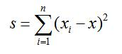
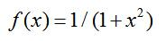

# 4.函数   

[TOC]   

## A+B II   
>**Description:** 豆豆今年3岁了，现在他已经能够认识100以内的非负整数，并且能够进行100以内的非负整数的加法计算。对于大于等于100的整数，豆豆仅保留该数的最后两位进行计算，如果计算结果大于等于100，那么豆豆也仅保留计算结果的最后两位。例如, 对于小明来说：（1）1234和34是相等的（2）35+80=15给定非负整数A和B, 你的任务是代表豆豆计算出A+B的值。   
>**Input:** 输入数据的第1行为一个正整数T，表示测试数据的组数，然后是T组测试数据。每组测试数据包含两个非负整数A和B（A和B均在int型可表示的范围内）。   
>**Output:** 对于每组测试数据, 输出豆豆A+B的结果。   
>**Sample Input:** 2
35 80
15 1152   
>**Sample Output:** 15
67   

```C
#include <stdio.h>

int plus(int a, int b) {
    return (a + b) % 100;
}

int main() {
    int n, a, b;
    scanf("%d", &n);
    while (n-- != 0) {
        scanf("%d %d", &a, &b);
        printf("%d\n", plus(a, b));
    }
    return 0;
}
```


## ACKERMAN   
>**Description:** 已知ack函数对于m≥0和n≥0有定义：ack(0,n)=n+1、ack(m,0)=ack(m-1,1)、ack(m,n)=ack(m-1,ack(m,n-1))。输入m和n，求解ack函数。   
>**Input:** 输入m和n，均为整型，用空格隔开。   
>**Output:** 输出为整型   
>**Sample Input:** 3 2   
>**Sample Output:** 29   


```C
#include <stdio.h>

// 根据所要求公式定义递归函数
int ack(int m, int n) {
    if (m == 0) {
        return n + 1;
    }
    if (n == 0) {
        return ack(m - 1, 1);
    }

    return ack(m - 1, ack(m, n - 1));
}

int main() {
    int m, n;
    scanf("%d %d", &m, &n);

    printf("%d\n", ack(m, n));

    return 0;
}
```


## 不会吧，又是A+B   
>**Description:** A+B是POJer的最爱。这不，今天这个A+B希望能给大家带来好运，也希望这个题目能唤起大家对ACM的热爱。这个题目的A和B不是简单的整数，而是两个时间，A和B 都是由3个整数组成，分别表示时、分、秒。比如，假设A为34 45 56，就表示A所表示的时间是34小时45分钟56秒。   
>**Input:** 输入数据每行有6个整数AH、AM、AS、BH、BM、BS，分别表示时间A和B所对应的时分秒。题目保证所有的数据合法。   
>**Output:** 输出A+B，每个输出结果也是由时分秒3部分组成，同时也要满足时间的规则（即分和秒的取值范围在0~59），每个输出占一行，并且所有的部分都可以用32位整数表示。   
>**Sample Input:** 1 2 3 4 5 6   
>**Sample Output:** 5 7 9   


## 亲和数   
>**Description:** 古希腊数学家毕达哥拉斯在自然数研究中发现，220的所有真约数（即不是自身的约数）之和为：1+2+4+5+10+11+20+22+44+55+110＝284而284的所有真约数为1+2+4+71+ 142加起来恰好为220。人们对这样的数感到很惊奇，称之为亲和数。一般地讲，如果两个数中任何一个数都是另一个数的真约数之和，则这两个数就是亲和数。现在，编写一个程序，判断给定的两个数是否是亲和数。   
>**Input:** 输入数据包含两个整数A、B，其中 0≤A，B≤600000   
>**Output:** 如果A和B是亲和数的话输出YES，否则输出NO。   
>**Sample Input:** 220 284   
>**Sample Output:** YES   

```C
#include <stdio.h>

int factors_sum(int n) {
    int sum = 1;
    for (int i = 2; i < n / 2 + 1; i++) {
        if (n % i == 0) {
            sum += i;
        }
    }
    return sum;
}

int main() {
    int n, m;
    scanf("%d %d", &n, &m);
    
    if (factors_sum(n) == m && factors_sum(m) == n) {
        printf("YES\n");
    } else {
        printf("NO\n");
    }
    
    return 0;
}
```


## 发工资的日子   
>**Description:** POJ公司的职员，最盼望的日子就是每月的8号，因为这一天是发工资的日子，养家糊口就靠它了，呵呵。但是对于公司财务部的职员来说，这一天则是最忙碌的一天。财务部的小明最近在考虑一个问题：如果每个员工的工资额都知道，最少需要准备多少张人民币，才能在给每位员工发工资的时候都不用员工找零呢？这里假设员工的工资都是正整数，单位元，人民币一共有100元、50元、10元、5元、2元和1元六种。   
>**Input:** 输入数据第一行是一个整数n（n＜100），表示员工的人数，然后是n个员工的工资。   
>**Output:** 输出一个整数x，表示至少需要准备的人民币张数。   
>**Sample Input:** 3
1 2 3   
>**Sample Output:** 4   

采用贪心的思想：能用大面值就用大面值
```C
#include <stdio.h>

// 计算需要的货币的数量
int count(int num[], int n) {
    int times = 0;
    for (int i = 0; i < n; i++) {
        while (num[i] != 0) {
            if (num[i] >= 100) {
                times += num[i] / 100;
                num[i] = num[i] % 100; 
            } else if (num[i] >= 50) {
                times += num[i] / 50;
                num[i] = num[i] % 50;
            } else if (num[i] >= 10) {
                times += num[i] / 10;
                num[i] = num[i] % 10;
            } else if (num[i] >= 5) {
                times += num[i] / 5;
                num[i] = num[i] % 5;
            } else if (num[i] >= 2) {
                times += num[i] / 2;
                num[i] = num[i] % 2;
            } else {
                times += num[i];
                num[i] = 0;
            }
        }
    }

    return times;
}

int main() {
    int n;
    scanf("%d", &n);
    int num[n];
    for (int i = 0; i < n; i++) {
        scanf("%d", &num[i]);
    }
    printf("%d\n", count(num, n));

    return 0;
}
```


## 循环移位   
>**Description:** 编写函数实现value左右循环移位（即移出的位在另一端填入）。函数原型为int move(int value,int n)；其中value为要循环移位的数，n为移位的位数，n的绝对值不大于16，整型为16位。如果n＜0表示左移，n＞0表示右移，n=0表示不移位。在主函数中输入数据并调用该函数输出结果。   
>**Input:** 输入value和n，均为整型，用空格隔开   
>**Output:** None   
>**Sample Input:** 134744064 -8   
>**Sample Output:** 134742024   
```C
#include <stdio.h>

int displace(int num, int n) {
    int size = sizeof(int) * 8;
    if (n > 0) {
        num = (num >> n | num << (size - n)); // 将位数保留，后续做或运算
    } else {
        n = -n;
        num = (num << n | num >> (size - n));
    }
    return num;
}

int main() {
    int num, n;
    scanf("%d %d", &num, &n);
    printf("%d\n", displace(num, n));
    return 0;
}
```


## 数据加密   
>**Description:** 某个公司采用公用电话传递数据，数据是四位的整数，在传递过程中是加密的。加密函数如下：每位数字都加上5，然后用除以10的余数代替该数字，再将第一位和第四位交换，第二位和第三位交换。   
>**Input:** 输入整型   
>**Output:** 输出整型   
>**Sample Input:** 1998   
>**Sample Output:** 3446   


## 方差   
>**Description:** 编写函数计算其中x为x1,x2,……的平均数。请记住：不能使用数组。   
>   
>**Input:** 第1行输入n，为整型   
>**Output:** 输出s，double型，小数点后6位。   
>**Sample Input:** 5
1 2 3 4 5   
>**Sample Output:** 10.000000   


## 最大整数   
>**Description:** 编写函数getfloor(x)，返回小于等于x的最大整数，例如getfloor(2.8)为2，getfloor(-2.8)为-3。   
>**Input:** 输入double型x。   
>**Output:** 输出整型。   
>**Sample Input:** 2.8   
>**Sample Output:** 2   

```C
#include <stdio.h>

int get_floor(double x) {
    if (x >= 0) return (int)x;
    if (x < 0) return (int)x - 1;
}

int main() {
    double n;
    scanf("%lf", &n);
    printf("%d\n", get_floor(n));
    return 0;
}
```


## 最小整数   
>**Description:** 编写函数fceil(x)，返回大于等于x的最小整数，例如fceil(2.8)为3，fceil(-2.8)为-2。   
>**Input:** 输入double型x。   
>**Output:** 输出整型。   
>**Sample Input:** 2.8   
>**Sample Output:** 3   

```C
#include <stdio.h>

int fceil(double x) {
    if (x >= 0) return (int)x + 1;
    if (x < 0) return (int)x;
}

int main() {
    double n;
    scanf("%lf", &n);
    printf("%d\n", fceil(n));
    return 0;
}
```


## 积分计算   
>**Description:** 已知编写函数用梯形法计算f(x)在区间[a,b]的积分   
>   
>**Input:** 输入a和b，a＜b，均为double型   
>**Output:** 输出为double型   
>**Sample Input:** 0.5 1   
>**Sample Output:** 0.321751   

```C
#include <stdio.h>

// 采用逼近法求解积分大小
double integral(double begin, double end) {
    double sum = 0.0;
    double interval = 0.0001;
    for (double i = begin; i <= (end - interval); i += interval) {
        double border_one = 1.0 / (1.0 + i * i);
        double border_two = 1.0 / (1.0 + (i + interval) * (i + interval));
        // 积分转化为梯形的面积的计算
        sum += (border_one + border_two) / 2.0 * interval;
    }
    return sum;
}

int main() {
    double begin, end;
    scanf("%lf %lf", &begin, &end);
    printf("%lf\n", integral(begin, end));
    return 0;
}
```

## 组合数   
>**Description:** 编写函数计算从n个元素中取m个元素的组合数C(m,n)。   
>**Input:** 输入n和m为整型，用空格隔开。   
>**Output:** 输出为整型。若无解输出wrong   
>**Sample Input:** 9 2   
>**Sample Output:** 36   


## 获取指定二进制位   
>**Description:** 编写函数getbit(n,k)；求出n从右边开始的第k位。在主函数中输入数据并调用该函数输出结果。   
>**Input:** 输入整型n和k（1≤k≤16），用空格分隔。   
>**Output:** 输出整型。   
>**Sample Input:** 128 8   
>**Sample Output:** 1   


## 逆序整数   
>**Description:** 用递归法将一个长整型数n逆序输出。例如输入483，输出384。n的位数不确定，可以是有效范围内的任意位数。   
>**Input:** 输入为整数   
>**Output:** 输出为整数   
>**Sample Input:** 4325879   
>**Sample Output:** 9785234   

```C
#include <stdio.h>

void reverse(int n) {
    printf("%d", n % 10);
    if ((n / 10) != 0) {
        reverse(n / 10);
    }
    return;
}

int main() {
    int n;
    scanf("%d", &n);
    reverse(n);
    printf("\n");
    return 0;
}
```


## 高低交换   
>**Description:** 编写内联函数inline int xchg(unsigned char n)，计算将unsigned char型n的低四位和高四位交换后的结果。在主函数中输入数据调用函数输出结果。   
>**Input:** 输入整型   
>**Output:** 输出整型   
>**Sample Input:** 194   
>**Sample Output:** 44   
```C
#include <stdio.h>

// 使用内联函数进行函数定义，对于不同的编译器可能不支持
inline int xchange(unsigned char n) {
    unsigned char x = n << 4; // 左移, 将低四位移入高四位，剩余补0
    unsigned char y = n >> 4; // 右移，将高四位移入低四位，剩余补0
    return (int)(x | y); // 进行或运算，返回结果
}

int main() {
    int n;
    scanf("%d", &n);
    printf("%d\n", xchange((unsigned char)n));
    return 0;
}
```


