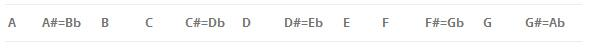
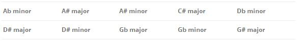

# 6.字符串   

[TOC]   

## Coin Test   
>**Description:** As is known to all,if you throw a coin up and let it droped on the desk there are usually three results. Yes,just believe what I say ~it can be the right side or the other side or standing on the desk, If you don’t believe this,just try In the past there were some famous mathematicians working on this .They repeat the throwing job once again. But jacmy is a lazy boy.He is busy with dating or playing games.He have no time to throw a single coin for 100000 times. Here comes his idea,He just go bank and exchange thousands of dollars into coins and then throw then on the desk only once. The only job left for him is to count the number of coins with three conditions.He will show you the coins on the desk to you one by one. Please tell him the possiblility of the coin on the right side as a fractional number if the possiblity between the result and 0.5 is no larger than 0.003. BE CAREFUL that even 1/2，50/100,33/66 are equal only 1/2 is accepted ! if the difference between the result and 0.5 is larger than 0.003,Please tell him “Fail”.Or if you see one coin standing on the desk,just say “WA” any way.   
>**Input:** The input is the result with N litters(1＜N＜1000).The letter are “U”,”D”,or “S”,”U” means the coin is on the right side. “D” means the coin is on the other side .”S” means standing on the desk.   
>**Output:** If test successeded,just output the possibility of the coin on the right side.If the test failed please output “Fail”,If there is one or more”S”,please output “WA”   
>**Sample Input:** UUUDDD   
>**Sample Output:** 1/2   

```C
#include <stdio.h>

const int MAX = 1024;

// 计算绝对值
double fabs(double result) {
    return result > 0 ? result : -1.0 * result;
}

// 求最大公因数，根据gcd(a, b) = gcd(b, a%b)
int gcd(int a, int b) {
    if (a % b == 0) return b;
    else return gcd(b, a % b);
}

int main() {
    char result[MAX];
    int right = 0, left = 0, stand = 0;
    
    scanf("%s", result);
    int index = 0;
    // 统计各个可能出现的次数
    for (; result[index] != '\0'; index++) {
        if (result[index] == 'U') {
            right++;
        } else if (result[index] == 'D') {
            left++;
        } else if (result[index] == 'S') {
            stand = 1;
        }
    }
    if (stand == 1) {
        printf("WA\n");
    } else {
        if (right + left != index) {
            return 0;
        } else {
            double err = fabs(1.0 * right / index - 0.5);
            if (err > 0.003) {
                printf("Fail\n");
            } else {
                int factor = gcd(right, index);
                printf("%d/%d\n", right / factor, index / factor);
            }
        }
    }
    return 0;
}
```


## Music Composer   
>**Description:** Mr. B is a famous music composer. One of his most famous work was his set of preludes. These 24 pieces span the 24 musical keys (there are musically distinct 12 scale notes, and each may use major or minor tonality). The 12 distinct scale notes are:Five of the notes have two alternate names, as is indicated above with equals sign. Thus, there are 17 possible names of scale notes, but only 12 musically distinct notes. When using one of these as the keynote for a musical key, we can further distinguish between major and minor tonalities. This gives 34 possible keys, of which 24 are musically distinct.In naming his preludes, Mr. B used all the keys except the following 10, which were named instead by their alternate names:Write a program that, given the name of a key, give an alternate name if it has one, or report the key name is unique.   
>   
   
>**Input:** Each test case is described by one line having the format “note tonality”, where “note” is one of the 17 names for the scale notes given above, and “tonality” is either “major” or “minor” (quotes for clarify).   
>**Output:** For each case output the required answer, following the format of the sample.   
>**Sample Input:** Ab minor   
>**Sample Output:** G# minor   

```C
#include <stdio.h>

int main() {
    char note[1024];
    while (gets(note) != NULL) {
        // 先将UNIQUE的进行判断
        if ((note[0] == 'A' || note[0] == 'B' || note[0] == 'C' || note[0] == 'D' || note[0] == 'E' || note[0] == 'F' || note[0] == 'G') && note[1] == ' ') {
            printf("UNIQUE\n");
        } else if (note[0] == 'A' && note[1] == '#') {
            note[0] = 'B';
            note[1] = 'b';
            printf("%s\n", note);
        } else if (note[0] == 'B' && note[1] == 'b') {
            note[0] = 'A';
            note[1] = '#';
            printf("%s\n", note);
        } else if (note[0] == 'C' && note[1] == '#') {
            note[0] = 'D';
            note[1] = 'b';
            printf("%s\n", note);
        } else if (note[0] == 'D' && note[1] == 'b') {
            note[0] = 'C';
            note[1] = '#';
            printf("%s\n", note);
        } else if (note[0] == 'D' && note[1] == '#') {
            note[0] = 'E';
            note[1] = 'b';
            printf("%s\n", note);
        } else if (note[0] =='E' && note[1] == 'b') {
            note[0] = 'D';
            note[1] = '#';
            printf("%s\n", note);
        } else if (note[0] == 'F' && note[1] == '#') {
            note[0] = 'G';
            note[1] = 'b';
            printf("%s\n", note);
        } else if (note[0] == 'G' && note[1] == 'b') {
            note[0] = 'F';
            note[1] = '#';
            printf("%s\n", note);
        } else if (note[0] == 'G' && note[1] == '#') {
            note[0] = 'A';
            note[1] = 'b';
            printf("%s\n", note);
        } else if (note[0] == 'A' && note[1] == 'b') {
            note[0] = 'G';
            note[1] = '#';
            printf("%s\n", note);
        } else {
            printf("false\n");
        }
    }
    return 0;
}
```


## The Clock   
>**Description:** Mr. N, Mr. W, Mr.P and Mr. U are now in DongDa, ChangAn, for the 2012 ACM-ICPC Campus Contest. They’ve decided to take a 5 hours training every day before the contest. Also, they plan to start training at 10:00 each day since the contest will do so. The scenery in DongDa is so attractive that Mr. N would always like to take a walk outside for a while after breakfast. However, Mr. N have to go back before training starts, otherwise his teammates will be annoyed. Here is a problem: Mr. N does not have a watch. In order to know the exact time, he has bought a new watch in DongDa, but all the numbers on that watch are represented in Roman Numerals. Mr. N cannot understand such kind of numbers. Can you translate for him?   
>**Input:** Each test case contains a single line indicating a Roman Numerals that to be translated. All the numbers can be found on clocks. That is, each number in the input represents an integer between 1 and 12. Roman Numerals are expressed by strings consisting of uppercase ‘I’, ‘V’ and ‘X’. See following the sample for further information.   
>**Output:** For each test case, display a single line containing a decimal number corresponding to the given Roman Numerals.   
>**Sample Input:** VIII   
>**Sample Output:** 8   


## 分离单词   
>**Description:** 编写程序以字符串为单位，以空格或标点符号（字符串中仅含英文逗号','或小数点'.'作为标点符号）作为分隔符，对字符串中所有单词进行倒排，然后把已处理的字符串（应不含标点符号）打印出来。   
>**Input:** 输入一个字符串（包含大小写字母、空格、逗号或小数点）   
>**Output:** 输出处理后的字符串。   
>**Sample Input:** I am a student. I like study.   
>**Sample Output:** study like I student a am I   

```C
#include <stdio.h>

const int MAX = 100;

const int LENGTH = 50;

int split(char *src, char (*dest)[LENGTH]) {
    int count = 0; // 计算分离出单词的数量
    int index = 0; // 在源字符串中的索引
    int is_word = 0; // 判断在该字符之前字符能否组成单词
    int is_split = 0; // 判断是否分割
    int j = 0; // 分离出的单词的临时长度
    for (; src[index] != '\0'; index++) {
        // 遇到分割符，应当进行分割， 要考虑连续多个都是分割符的情况
        if (src[index] == ' ' || src[index] == '.' || src[index] == ',') {
            is_split = 1; 
        }
        // 如果是字母，则表示可以组成单词
        if ((src[index] >= 'A' && src[index] <= 'Z') || (src[index] >= 'a' && src[index] <= 'z')) {
            is_word = 1;
            dest[count][j++] = src[index];
        }
        // 如果是连续的分割符但不是字母，不能组成单词
        if (is_split == 1 && is_word == 0) {
            is_split = 0;
            is_word = 0;
        }
        // 当为单词开头且到分割符或者是结束符的时候，分割单词
        if ((is_split == 1 || src[index + 1] == '\0') && is_word == 1) {
            dest[count][j] = '\0';
            count++;
            j = 0;
            is_word = 0;
            is_split = 0;
        }
    }
    return count;
}

int main() {
    char src[5000] = {'\0'};
    char dest[MAX][LENGTH] = {"\0"};
    gets(src);
    int count = split(src, dest);
    int i = count - 1;
    for (; i >= 0; i--) {
        printf("%s ", dest[i]);
    }
    return 0;
}
```


## 删除字符   
>**Description:** 编制函数void deletechar(char S[],char c)，其功能是删除一个字符串S中指定的字符c。要求原始字符串在主函数中输入，处理后的字符串在主函数中输出。   
>**Input:** 第1行输入字符串   
>**Output:** 输出为字符串。   
>**Sample Input:** Nikon: wfeel thew awir arouwnd the wuniverse
w   
>**Sample Output:** Nikon: feel the air around the universe   

```C
#include <stdio.h>

const int length = 100;

void delete_char(char *s, char c) {
    int index = 0; // 用来指示原始数组的下标
    int count = 0; // 用来指示删除字符c后的下标
    while (s[index] != '\0') {
        if (s[index] != c) {
            s[count] = s[index];
            count++;
        }
        index++;
    }
    s[count] = '\0'; // 重置数组长度
}

int main() {
    char s[length];
    char c;
    gets(s);
    scanf("%c", &c);
    delete_char(s, c);
    printf("%s\n", s);
    return 0;
}
```

## 合并字符串   
>**Description:** 编写一个函数void stringmerge(char S1[],char S2[])，对键盘输入的两个字符串S1和S2进行连接，结果送回到S1中。在主函数输入输出，调用这个函数合并字符串。   
>**Input:** 用2行分别输入2个字符串。   
>**Output:** 输出为字符串。   
>**Sample Input:** hello
world   
>**Sample Output:** helloworld   


## 字符串复制   
>**Description:** 输入任意一个字符串（包含n个字符，1≤n≤100），编写函数，将此字符串中从第m个字符开始（以0起始）的全部字符复制成为另一个字符串并输出（m＜n）。   
>**Input:** 第1行输入字符串，第2行输入整数m。   
>**Output:** 输出为字符串。   
>**Sample Input:** 112233445566778899
7   
>**Sample Output:** 45566778899   


## 字符串左中右   
>**Description:** 编写实现下面字符串操作要求的函数。在主函数中输入字符串"www.nwpu.edu.cn"，调用函数并得到结果。（1）函数void Left(char src[],int n,char dest[])将字符串src左边n个字符复制到dest中。（2）函数void Right(char src[],int n,char dest[])将字符串src右边n个字符复制到dest中。（3）函数void Mid(char src[],int loc,int n,char dest[])将字符串src自下标loc开始的n个字符复制到dest中。   
>**Input:** 第1行输入字符串，第2行输入n和loc值，用空格分隔。   
>**Output:** 第1行输出调用函数Left的结果，第2行输出调用函数Right的结果，第3行输出调用函数Mid的结果   
>**Sample Input:** www.nwpu.edu.cn
5 5   
>**Sample Output:** www.n
du.cn
wpu.e   


```C
#include <stdio.h>

void left(char *src, int n, char *dest) {
    int i;
    for (i = 0; i < n; i++) {
        dest[i] = src[i];
    }
    dest[i] = '\0';
    return;
}

void mid(char *src, int local, int n, char *dest) {
    int i;
    for (i = 0; i < n; i++) {
        dest[i] = src[local + i];
    }
    dest[i] = '\0';
    return;
}

void right(char *src, int n, char *dest) {
    int length = 0;
    while (src[length++] != '\0');
    
    int local = length - n - 1;
    int i;
    for (i = 0; i < n; i++) {
            dest[i] = src[local + i];
    }
    dest[i] = '\0';
    return;
}


int main() {
    char src[1000], dest[1000];
    int n, local;
    scanf("%s", src);
    scanf("%d %d", &n, &local);

    left(src, n, dest);
    printf("%s\n", dest);
    right(src, n, dest);
    printf("%s\n", dest);
    mid(src, local, n, dest);
    printf("%s\n", dest);

    return 0;
}
```


## 字符串排序   
>**Description:** 在主函数中输入10个等长的字符串（每个字符串最多10个字符），用另一个函数对它们进行由小到大排序，然后在主函数中输出这10个已排好序的字符串。   
>**Input:** 输入10个等长的字符串，用空格分隔。   
>**Output:** 输出排序后的10个字符串，用空格分隔。   
>**Sample Input:** she its can ibm bbc NBA nhk BOY jxf eat   
>**Sample Output:** BOY NBA bbc can eat ibm its jxf nhk she   

```C
#include <stdio.h>
#include <string.h>
#include <stdlib.h>

// 比较函数
int compare(const void* tmp1, const void* tmp2) {
    char * str1 = (char *) tmp1;
    char * str2 = (char *) tmp2;
    return strcmp(str1, str2);
}

int main() {
    char strs[10][50];
    for (int i = 0; i < 10; i++) {
        scanf("%s", strs[i]);
    }
    // 使用stdlib快速排序
    qsort(strs, 10, sizeof(strs[0]), compare);

    for (int i = 0; i < 10; i++) {
        printf("%s ", strs[i]);
    }
    printf("\n");
    return 0;
}
```

## 字符串替换   
>**Description:** 编写一个程序实现将字符串中的所有”you”替换成”we”   
>**Input:** 输入数据是一个字符串，长度不超过1000   
>**Output:** 对于输入的每一行，输出替换后的字符串   
>**Sample Input:** you are what you do   
>**Sample Output:** we are what we do   

```C
#include <stdio.h>
#include <stdlib.h>
#include <string.h>

char * replace(char *src, char *oldstr, char *newstr) {
    char buffer_str[strlen(src)]; // 设置缓冲字符串
    memset(buffer_str, 0, sizeof(buffer_str)); // 初始化缓冲字符串

    // 在字符串src中查找是否存oldstr, 如果存在将新字符串复制到缓冲字符串，否则只将当前字符复制到缓冲字符串
    for (int i = 0; i < strlen(src); i++) {
        if (!strncmp(src + i, oldstr, strlen(oldstr))) {
            strcat(buffer_str, newstr);
            i += strlen(oldstr) - 1;
        } else {
            strncat(buffer_str, src + i, 1);
        }
    }
    
    strcpy(src, buffer_str);
    return src;
}

int main() {
    char str[1000];
    gets(str);
    replace(str, "you", "we");
    printf("%s\n", str);
    return 0;
}
```

## 字符串比较   
>**Description:** 请编写一个函数int stringcompare(char S1[],char S2[])，将两个字符串S1和S2比较。如果S1＞S2，输出一个正数；S1=S2，输出0；S1＜S2，输出一个负数。在主函数两个字符串用gets函数读入。输出的正数或负数的绝对值应是相比较的两个字符串相对应字符的ASCII码的差值。例如，’A’与’C’相比，由于’A’＜’C’，应输出负数，由于’A’与’C’的码差值为2，因此应输出“－2”。同理：“And”和“Aid:”比较，根据第2个字符比较结果，’n’比’i’大5，因此应输出“5”。   
>**Input:** 第1行输入S1，第2行输入S2。   
>**Output:** 输出为整型。   
>**Sample Input:** And
Aid   
>**Sample Output:** 5   

```C
#include <stdio.h>

int compare(char *str1, char *str2) {
    int index = 0;
    while (str1[index] != '\0' && str2[index] != '\0' && str1[index] == str2[index]) {
        index++;
    }

    return (int)(str1[index] - str2[index]);
}

int main() {
    char str1[100], str2[100];
    gets(str1);
    gets(str2);

    printf("%d\n", compare(str1, str2));

    return 0;
}
```


> 对于字符串要实现一个动态增加长度，通过最终输入来确定数组的长度(以换行符作为结束符)

```C
#include <stdio.h>
#include <stdlib.h>

const int basic = 4;

char* scan(char *str) {
    if (str == NULL) {
        str = malloc(basic * sizeof(char));
    }
    int length = basic;
    int index = 0;
    while (scanf("%c", (str + index)) != EOF) {
        index++;
        if (str[index - 1] == '\n') {
            break;
        }
        if (index >= length) {
            length = length << 1;
            str = realloc(str, length);
        }
    }
    str[index - 1] = '\0';
    return str;
}

int main() {
    char *str = malloc(basic * sizeof(char));
    str = scan(str);
    printf("%s", str);
    return 0;
}
```

## 字符串逆序   
>**Description:** 请编写程序，对键盘输入的字符串进行逆序，逆序后的字符串仍然保留在原来字符数组中，最后输出。（不得调用任何字符串处理函数），例如：输入 输出。   
>**Input:** 输入字符串时，输入以等号（=）结束（注意不是回车）   
>**Output:** 输出为字符串。   
>**Sample Input:** hello world=
dlrow olleh   
>**Sample Output:** dlrow olleh   

```C
#include <stdio.h>

// 反转字符串
void reverse(char *str) {
    int length = 0;
    while (str[length++] != '\0');
    length -= 1;
    int left = 0;
    int right = length - 1;
    while (left < right) {
        char temp = str[left];
        str[left] = str[right];
        str[right] = temp;

        left++;
        right--;
    }
}

int main() {
    char str[1000];
    gets(str);
    int i = 0;
    while (str[i++] != '=');
    str[i - 1] = '\0';

    reverse(str);
    printf("%s\n", str);

    return 0;
}
```


## 找出数字   
>**Description:** 输入一个字符串，内有数字和非数字字符。例如：a123x456 17960 302tab5876。将其中连续的数字作为一个整数，依次存放到一维数组a中，例如123放在a[0]，456放在a[1]……统计共有多少个整数，并输出这些数。   
>**Input:** 输入一个字符串（允许空格）。   
>**Output:** 第1行输出个数，第2行输出多个整数，用空格分隔。   
>**Sample Input:** a123X456  7689?89njmk32lnk123   
>**Sample Output:** 6
123 456 7689 89 32 123   

```C
#include <stdio.h>

const int length = 1000; // 定义数组长度

// 返回str中数字的个数，并将数字写入arr
int string_to_int(char *str, int * arr) {
    int temp = 0;
    int count = 0; // 定义数字个数
    for (int i = 0; str[i] != '\0'; i++) {
        if (str[i] >= '0' && str[i] <= '9') {
            temp = (str[i] - '0') + temp * 10;
            if (str[i + 1] == '\0' || str[i + 1] < '0' || str[i + 1] > '9') {
                arr[count] = temp;
                count++;
                temp = 0;
            }
        }
    }
    return count;
}

int main() {
    int arr[length];
    char str[length];
    gets(str);
    int count = string_to_int(str, arr);
    printf("%d\n", count);
    for (int i = 0; i < count; i++) {
        printf("%d ", arr[i]);
    }
    printf("\n");

    return 0;
}
```

## 文章统计   
>**Description:** 有一篇文章，共有3行文字，每行最多有80个字符。编写程序分别统计出文章中英文大写字母、小写字母、数字、空格及其他字符的个数。   
>**Input:** 输入3行字符串   
>**Output:** 输出英文大写字母、小写字母、数字、空格、其他字符的个数，用空格分隔。   
>**Sample Input:** Nikon at the frontiers of science.
Flash(Adobe Flash Media Rights Management Server)
21.03,-0.87,-3.97%   
>**Sample Output:** 8 62 10 10 11   


## 特殊要求的字符串   
>**Description:** 编写程序对字符串按下面给定的条件进行排序，排序后的结果仍按行重新存入字符串中并打印出来。条件：从字符串中间一分为二，左边部分按字符的ASCII值降序排序，右边部分按字符的ASCII值升序排序；排序后，左边部分与右边部分进行交换。如果原字符串长度为奇数，则最中间的字符不参加排序，字符仍放在原位置上。   
>**Input:** 输入一行字符串。   
>**Output:** 输出结果字符串。   
>**Sample Input:** abcd9876   
>**Sample Output:** 6789dcba   


