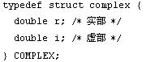

# 7.复杂数据   

[TOC]   

## POJer的烦恼   
>**Description:** ACM队的POJer小C经常抱怨：“C语言中格式输出中有十六、十、八进制输出，却没有二进制输出，哎，谁能帮我写一个程序实现输入一个十进制数n，输出它的二进制数呀？”你能帮帮他吗？   
>**Input:** 输入数据n（0≤n≤1000010000）   
>**Output:** 输出对应一个十进制数n的二进制数，注意：输出的二进制去掉任何一个多余的0。   
>**Sample Input:** 9   
>**Sample Output:** 1001   

```C
#include <stdio.h>
#include <memory.h>
const int length = 16;

/**
 * 将十进制num转化为二进制，并存在array数组中
 * 返回转为二进制数组的长度
 */
int transfer(int num, int *array) {
    int index = 0;
    while (num > 0) {
        *(array + index) = num % 2;
        num = num / 2;
        index++;
    }
    return index;
}

int main() {
    int arr[length];
    int num;
    scanf("%d", &num);
    memset(arr, 0, length * sizeof(arr[0]));
    int index = transfer(num, arr);
    for (int i = index - 1; i >= 0; i--) {
        printf("%d", arr[i]);
    }
    printf("\n");
    return 0;

}
```


## 分数加减法   
>**Description:** 编写一个C程序，实现两个分数的加减法。   
>**Input:** 每行数据是一个字符串，格式是“a/b+c/d”或“a/b-c/d”。其中a, b, c, d是一个0-9的整数。b、d不为0。输入数据保证合法。   
>**Output:** 对于输入数据的每一行输出两个分数的运算结果。注意结果应符合书写习惯，没有多余的符号、分子、分母，并且化简至最简分数。例如：“1/4-1/2”的结果是-1/4，“1/3-1/3”的结果是0。   
>**Sample Input:** 1/8+3/8   
>**Sample Output:** 1/2   


## 单词频次   
>**Description:** 编写程序统计DATA5610.TXT文件中出现"if","while","for"单词的次数。   
>**Input:** 用记事本自行建立一个DATA5610.TXT文件，存放在源程序在相同的文件夹中，用来测试自己的程序。   
>**Output:** 分别输出"if","while","for"单词的次数，用空格分隔。例如某个文件中包含2个if,3个while,4个for单词。   
>**Sample Input:** None   
>**Sample Output:** 2 3 4   


## 复数   
>**Description:** 定义下面结构表示复数：编写四个函数分别实现复数的和、差、积、商计算，在主函数中输入数据并调用这些函数得到复数运算结果。   
>   
>**Input:** 第1行输入第1个复数的实部和虚部，第2行输入第2个复数的实部和虚部   
>**Output:** 输出数据格式为%+.2lf，输出格式如下结果显示。   
>**Sample Input:** -1 5
4 3   
>**Sample Output:** (-1.00+5.00i)+(4.00+3.00i)=(3.00+8.00i)
(-1.00+5.00i)-(4.00+3.00i)=(-5.00+2.00i)
(-1.00+5.00i)*(4.00+3.00i)=(-19.00+17.00i)
(-1.00+5.00i)/(4.00+3.00i)=(0.44+0.92i)   

```C
#include <stdio.h>
#include <stdlib.h>

typedef struct complex {
    double real; // 实部
    double image; // 虚部 
} Complex;

Complex add(Complex *self, Complex *other) {
    Complex result;
    result.real = self->real + other->real;
    result.image = self->image + other->image;
    return result;
}

Complex minus(Complex *self, Complex *other) {
    Complex result;
    result.real = self->real - other->real;
    result.image = self->image - other->image;
    return result;
}

Complex multiply(Complex *self, Complex *other) {
    Complex result;
    result.real = self->real * other->real - self->image * other->image;
    result.image = self->real * other->image + self->image * other->real;
    return result;
}

Complex divide(Complex *self, Complex *other) {
    double denominator = other->real * other->real + other->image * other->image;
    Complex other_reflect;
    other_reflect.real = other->real;
    other_reflect.image = -1.0 * other->image;
    Complex result;
    result = multiply(self, &other_reflect);
    result.real /= denominator;
    result.image /= denominator;
    return result;
}

int main() {
    Complex a, b;
    scanf("%lf %lf", &a.real, &a.image);
    scanf("%lf %lf", &b.real, &b.image);
    Complex add_result = add(&a, &b);
    Complex minus_result = minus(&a, &b);
    Complex multiply_result = multiply(&a, &b);
    Complex divide_result = divide(&a, &b);
    printf("(%.2lf%+.2lfi)+(%.2lf%+.2lfi)=(%.2lf%+.2lfi)\n", a.real, a.image, b.real, b.image, add_result.real, add_result.image);
    printf("(%.2lf%+.2lfi)-(%.2lf%+.2lfi)=(%.2lf%+.2lfi)\n", a.real, a.image, b.real, b.image, minus_result.real, minus_result.image);
    printf("(%.2lf%+.2lfi)*(%.2lf%+.2lfi)=(%.2lf%+.2lfi)\n", a.real, a.image, b.real, b.image, multiply_result.real, multiply_result.image);
    printf("(%.2lf%+.2lfi)/(%.2lf%+.2lfi)=(%.2lf%+.2lfi)\n", a.real, a.image, b.real, b.image, divide_result.real, divide_result.image);

    return 0;

}
```

> 函数传指针的写法在CPSKILL平台上会报Compile Error(🤔🤔🤔),本地llvm没问题
```C
#include <stdio.h>
#include <stdlib.h>

typedef struct complex {
    double real; // 实部
    double image; // 虚部 
} Complex;

Complex* add(Complex* self, Complex* other) {
    Complex *result = malloc(sizeof(Complex));
    result->real = self->real + other->real;
    result->image = self->image + other->image;
    return result;
}

Complex* minus(Complex *self, Complex *other) {
    Complex *result = malloc(sizeof(Complex));
    result->real = self->real - other->real;
    result->image = self->image - other->image;
    return result;
}

Complex* multiply(Complex *self, Complex *other) {
    Complex *result = malloc(sizeof(Complex));
    result->real = self->real * other->real - self->image * other->image;
    result->image = self->real * other->image + self->image * other->real;
    return result;
}

Complex* divide(Complex *self, Complex *other) {
    double denominator = other->real * other->real + other->image * other->image;
    Complex other_reflect;
    other_reflect.real = other->real;
    other_reflect.image = -1.0 * other->image;
    Complex *result = malloc(sizeof(Complex));
    result = multiply(self, &other_reflect);
    result->real /= denominator;
    result->image /= denominator;
    return result;
}

int main() {
    Complex a, b;
    scanf("%lf %lf", &a.real, &a.image);
    scanf("%lf %lf", &b.real, &b.image);
    Complex *_add = add(&a, &b);
    Complex *_minus = minus(&a, &b);
    Complex *_multiply = multiply(&a, &b);
    Complex *_divide = divide(&a, &b);
    printf("(%.2lf%+.2lfi)+(%.2lf%+.2lfi)=(%.2lf%+.2lfi)\n", a.real, a.image, b.real, b.image, _add->real, _add->image);
    printf("(%.2lf%+.2lfi)-(%.2lf%+.2lfi)=(%.2lf%+.2lfi)\n", a.real, a.image, b.real, b.image, _minus->real, _minus->image);
    printf("(%.2lf%+.2lfi)*(%.2lf%+.2lfi)=(%.2lf%+.2lfi)\n", a.real, a.image, b.real, b.image, _multiply->real, _multiply->image);
    printf("(%.2lf%+.2lfi)/(%.2lf%+.2lfi)=(%.2lf%+.2lfi)\n", a.real, a.image, b.real, b.image, _divide->real, _divide->image);

    free(_add);
    free(_minus);
    free(_multiply);
    free(_divide);
    
    return 0;

}
```

## 子字符串替换   
>**Description:** 编写函数void replace(char *str,char *fstr,char *rstr)，将str所指字符串中凡是与fstr字符串相同的字符替换成rstr（rstr与fstr的字符长度不一定相同）。从主函数中输入原始字符串"iffordowhileelsewhilebreak"、查找字符串"while"和替换字符串"struct"，调用函数得到结果。   
>**Input:** 第1行输入要替换的字符串str，第2行输入查找字符串fstr，第3行输入替换字符串rstr。   
>**Output:** 输出替换后的字符串str。   
>**Sample Input:** iffordowhileelsewhilebreak
while
struct   
>**Sample Output:** iffordostructelsestructbreak   


## 字符串加密编码   
>**Description:** 编写函数void strencode(char *s)；函数的功能是将字符串中的大写字母加3，小写字母减3。在主函数中输入字符串，调用函数后输出结果字符串。   
>**Input:** 输入一行字符串。   
>**Output:** 输出编码操作后的字符串。   
>**Sample Input:** ABCDEF   
>**Sample Output:** DEFGHI   

```C
#include <stdio.h>

void encrypt(char *str) {
    for (int i = 0; str[i] != '\0'; i++) {
        if (str[i] >= 'A' && str[i] <= 'Z') {
            str[i] += 3;
        }
        if (str[i] >= 'a' && str[i] <= 'z') {
            str[i] -= 3;
        }
    }
    return;
}

int main() {
    char str[200];
    gets(str);
    encrypt(str);
    printf("%s\n", str);
    return 0;
}
```


## 小型数据库   
>**Description:** 编写程序完成：①输入若干学生的数据：学号(int)，姓名(char [12])，成绩(int)，并存储在文件DATA5614.DB中；②从文件中再读出学生数据，打印成绩最好的学生的相关信息。   
>**Input:** 第1行输入学生人数n，第2行输入n个人数的学号、姓名、成绩，用空格分隔。   
>**Output:** 输出成绩最好的学生的记录，用空格分隔。   
>**Sample Input:** 5
101 zhang 78 106 wang 88 107 chen 78 103 wang 88 104 chen 98   
>**Sample Output:** 104 chen 98   


## 成绩表计算   
>**Description:** 设有学生信息如下：学号（长整型）、姓名（字符串）、年龄（整型），英语、数学、语文、政治、物理、化学、计算机成绩（均为实型），总分（实型）、平均分（实型）。编写程序输入10个学生信息，计算每个学生的总分、平均分，然后输出总分最高的学生记录。   
>**Input:** 输入10行记录，用空格分隔。   
>**Output:** 输出总分最高的学生记录，成绩保留2位小数，用空格分隔。   
>**Sample Input:** 101 zhang 18 76  83  74  80  87  95  78
102 chen  19 86  73  83  72  66  98  60
103 yuan  20 83  99  82  74  85  67  98
104 zhou  21 96  64  95  94  83  71  60
105 huang 22 84  94  83  98  77  95  95
106 jiang 23 70  63  75  71  90  67  84
107 ding  24 63  67  67  68  64  91  99
108 qin   25 68  64  67  78  66  88  77
109 deng  26 67  70  88  66  85  92  88
110 gao   27 73  95  84  77  79  82  64   
>**Sample Output:** 105 huang 22 84.00 94.00 83.00 98.00 77.00 95.00 95.00   

```C
#include <stdio.h>

struct student {
    long no; // 学号
    char name[100]; // 姓名
    int age; // 年龄
    double en_score; // 英语
    double math_score; // 数学
    double zh_score; // 语文
    double politics_score; // 政治
    double physics_score; // 物理
    double chem_score; // 化学
    double computer_score; // 计算机
    double sum;
    double average;
};

int main() {
    struct student std[10];
    int index = 0;
    double sum = 0.0;
    for (int i = 0; i < 10; i++) {
        scanf("%ld %s %d %lf %lf %lf %lf %lf %lf %lf",
            &(std[i].no), std[i].name, &(std[i].age),
            &(std[i].en_score), &(std[i].math_score), &(std[i].zh_score),
            &(std[i].politics_score), &(std[i].physics_score), &(std[i].chem_score),
            &(std[i].computer_score));
        std[i].sum = std[i].en_score + std[i].math_score + std[i].zh_score + std[i].politics_score +
                     std[i].physics_score + std[i].chem_score + std[i].computer_score;
        std[i].average = std[i].sum / 7.0;
        if (sum < std[i].sum) {
            sum = std[i].sum;
            index = i;
        }
    }

    printf("%ld %s %d %.2lf %.2lf %.2lf %.2lf %.2lf %.2lf %.2lf\n",
    std[index].no, std[index].name, std[index].age,
    std[index].en_score, std[index].math_score, std[index].zh_score,
    std[index].politics_score, std[index].physics_score, std[index].chem_score,
    std[index].computer_score); 
}
```


## 插入字符   
>**Description:** 使用字符指针编写程序，输入一个长度不超过80的字符串a，在字符串a的i处（0＜i＜80）位置插入字符x，输出插入后的字符串a。例如：输入nw world在1处插入e输出new world。   
>**Input:** 第1行输入字符串，第2行输入字符x和i值，用空格分隔。   
>**Output:** 输出插入字符后的字符串。   
>**Sample Input:** nw world
e 1   
>**Sample Output:** new world   

```C
#include <stdio.h>
#include <string.h>

void insert(char *str, int index, char c) {
    int length = (int)strlen(str);
    str[length + 1] = '\0';
    for (int i = length; i > index; i--) {
        str[i] = str[i - 1];
    }
    str[index] = c;
    return;
}

int main() {
    char str[81] = "";
    gets(str);
    int index;
    char c;
    scanf("%c %d", &c, &index);
    insert(str, index, c);
    printf("%s\n", str);
    return 0;
}
```


## 搜索字符   
>**Description:** 编写函数char* search(char *cpsource,char ch)，该函数在一个字符串中找到可能的最长的子字符串，该字符串是由同一字符组成的。从主函数中输入"aabbcccddddeeeeeffffff"和'e'，调用函数得到结果。   
>**Input:** 第1行输入字符串，第2行输入字符ch。   
>**Output:** 输出子字符串   
>**Sample Input:** aabbcccddddeeeeeffffff
e   
>**Sample Output:** eeeee   


## 文件比较   
>**Description:** 已有两个文本文件（DATA5613.TXT和DATA5613.CPP），请编写程序从这两个文件中读出各行字符，逐个比较这两个文件中相应的行和列上的字符，如果遇到互不相同的字符，输出它是第几行第几列的字符。   
>**Input:** 用记事本自行建立DATA5613.TXT和DATA5613.CPP文件，输入一些数据测试，存放在与程序相同的文件夹中。   
>**Output:** 输出互不相同字符的行和列值，一行一个字符，用空格分隔。   
>**Sample Input:** None   
>**Sample Output:** 1 7
3 6
7 9   

```C
#include <stdio.h>

const int MAX_LINE = 1024; // 设置一行最大的读取数

int main() {
    FILE *src, *dst;
    char src_line[MAX_LINE], dst_line[MAX_LINE];
    int line = 0; // 记录当前行数
    int index = 0; // 记录当前列数

    // 打开文件
    src = fopen("DATA5613.TXT", "r");
    dst = fopen("DATA5613.CPP", "r");

    if (src != NULL && dst != NULL) {
        while (fgets(src_line, MAX_LINE, src) != NULL && fgets(dst_line, MAX_LINE, dst) != NULL) {
            line++; // 题目要求是从1开始计算行数
            // 从两个文件中读取的字符串进行比较
            while (src_line[index] != '\0' && dst_line[index] != '\0') {
                // 不相等则输出对应的行数与列数
                if (src_line[index] != dst_line[index]) {
                    printf("%d %d\n", line, index + 1);
                }
                index++;
            }
            index = 0; // 重置列数
        }
        // 关闭文件
        fclose(src);
        fclose(dst);
    }
    return 0;
}
```

## 检查图像文件格式   
>**Description:** 互联网上最流行三种图片格式为：JPEG、GIF、PNG。这三个格式的文件，包含特殊图像数据。如果是JPEG文件，其文件偏移第6个字节处（以0起始）为JFIF；如果是GIF文件，其文件偏移第0个字节处（以0起始）为GIF89a；如果是PNG文件，其文件偏移第1个字节处（以0起始）为PNG。现在编写程序，判断一个数据文件DATA5609.DAT是什么格式？   
>**Input:** 自行从互联网上下载一个图像文件，更名为DATA5609.DAT来测试。例如是一个JPEG文件。   
>**Output:** 根据格式分别JPEG、GIF、PNG字符串。若不是这三种格式，输出NULL   
>**Sample Input:** None   
>**Sample Output:** JPEG   

```C
# include <stdio.h>
# include <string.h>

const char JPEG[] = "JFIF";
const char GIT[] = "GIF89a";
const char PNG[] = "PNG";

int main() {
    // 打开二进制文件
    FILE *pic = fopen("DATA5609.DAT", "rb");
    // 存储文件类型 JPEG => JFIF GIF => GIF89a PNG => PNG
    char jpeg_type[5] = "\0";
    char gif_type[7] = "\0";
    char png_type[4] = "\0";
    
    // 读取jpeg文件
    fseek(pic, 6, SEEK_SET); // 偏移文件指针
    fread(jpeg_type, sizeof(char), 4, pic); // 读取指定位置内容
    rewind(pic); // 重制指针为文件开始


    // 读取GIF文件
    fread(gif_type, sizeof(char), 6, pic);
    

    // 读取png文件
    fseek(pic, 1, SEEK_SET);
    fread(png_type, sizeof(char), 3, pic);
    rewind(pic);

    // 判断文件类型
    if (strcmp(jpeg_type, JPEG) == 0) {
        printf("JPEG\n");
    } else if (strcmp(gif_type, GIT) == 0) {
        printf("GIF\n");
    } else if (strcmp(png_type, PNG) == 0) {
        printf("PNG\n");
    } else {
        printf("NULL\n");
    }

    fclose(pic);
    return 0;
}
```


## 检测位图长宽   
>**Description:** 24位BMP位图文件DATA5611.BMP由文件头、位图信息头和图形数据三部分组成。文件头主要包含文件大小、文件类型、图像数据偏离文件头的长度等信息；位图信息头包含图像尺寸信息、图像像素字节数、是否压缩、图像所用颜色数等信息（http://www.wotsit.org/网站上有各种图形图像、音频视频、文档文件格式的说明）。根据位图文件格式定义文件头、位图信息头结构体类型，从位图文件读取结构体数据从而得到位图文件信息。编写程序求DATA5611.BMP位图的长和宽。   
>**Input:** 用绘图工具自行创建一个20x20的DATA5611.BMP位图文件，存放在源程序在相同的文件夹中，用来测试自己的程序。   
>**Output:** 输出位图的长和宽，用空格分隔。   
>**Sample Input:** None   
>**Sample Output:** 20 20   

```C
#include <stdio.h>

// 设置字节对齐
#pragma pack(1)

// 位图文件头
struct bitmap_header {
   unsigned short bfType; // 标识
   unsigned int bfSize; // 文件大小
   unsigned short bfReserved1; // 保留字1
   unsigned short bfReserved2; // 保留字2
   unsigned int bfOffBits; // 偏移数 
};

// 位图信息头
struct bitmap_info {
    unsigned int biSize; // 位图信息头的大小
    long biWidth; // 位图的宽度， 单位为像素
    long biHeight; // 位图的高度， 单位为像素
    unsigned short biPlanes; // 固定值1
    unsigned short biBitCount; // 每个像素的位数
    unsigned int biCompression; // 压缩方式
    unsigned int biSizeImage; // 位图全部像素占用的字节数
    long biXPelsPerMeter; // 水平分辨率
    long biYPelsPerMeter; // 垂直分辨率
    unsigned int biClrUsed; // 位图使用的颜色数
    unsigned int biClrImportant; // 重要的颜色数
};

int main() {
    struct bitmap_header header;
    struct bitmap_info info;
    FILE *bmf;

    // 读取文件
    bmf = fopen("DATA5611.bmp", "rb");

    if (bmf != NULL) {
        fread(&header, sizeof(struct bitmap_header), 1, bmf);
        fread(&info, sizeof(struct bitmap_info), 1, bmf);
        printf("%ld %ld\n", info.biWidth, info.biHeight);
        fclose(bmf);
    }
    return 0;
}
```


## 源程序添加行号   
>**Description:** 编写程序给源程序文件DATA5612.CPP加上行号后存储到另外一个文本文件DATA5612.TXT中。   
>**Input:** 用记事本自行建立一个DATA5612.CPP文件，输入一些源程序测试，存放在与程序相同的文件夹中。   
>**Output:** 程序运行结果是产生文件，无输出显示。下面是文件测试结果：   
>**Sample Input:** None   
>**Sample Output:** None   

```C
#include <stdio.h>

const int MAX = 1024; // 设置每行的最大数量

int main() {
    FILE *in; // 读入文件
    FILE *out; // 写入文件
    int line = 0;
    char in_line[MAX], out_line[MAX];

    // 读写的文件指针都不为空
    in = fopen("DATA5612.CPP", "r");
    out = fopen("DATA5612.TXT", "w");

    if (in != NULL && out != NULL) {
        // 读到读入文件的结尾
        while(fgets(in_line, MAX, in) != NULL) {
            sprintf(out_line, "%04d %s", ++line, in_line);
            fputs(out_line, out);
        }
        fclose(in);
        fclose(out);
    }
    return 0;
    
}
```


## 重组字符串   
>**Description:** 编写函数void fun(char *s,char *t)，将参数s所指字符串中除了下标为奇数，同时ASCII值也为奇数的字符之外，其余的所有字符都删除，串中剩余字符所形成的一个新串放在参数t所指的数组并返回给调用函数（例如：输入0123456789，结果为13579）。从主函数中输入并调用函数得到结果。   
>**Input:** 输入一行字符串。   
>**Output:** 输出重组后的字符串。   
>**Sample Input:** 0123456789   
>**Sample Output:** 13579   

```C
#include <stdio.h>

void filters(char *str, char *dest) {
    int index = 0;
    for (int i = 0; str[i] != '\0'; i++) {
        if ((i % 2 == 1) && (str[i] % 2 == 1)) {
            dest[index] = str[i];
            index++; 
        }
    }
    dest[index] = '\0';
    return;
}

int main() {
    char str[81], dest[81];
    gets(str);
    filters(str, dest);
    printf("%s\n", dest);
    return 0;
}
```
