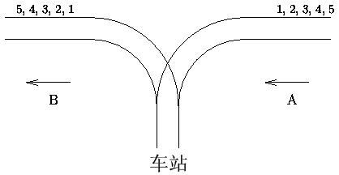

# 8.数据结构   

[TOC]   

## Symmetric Sort   
>**Description:** In your job at DongDa Management Inc.(yes, it’s run by a bunch of clowns), you have just finished writing a program whose output is a list of names in nondescending order by length (so that each name is at least as long as the one preceding it). However, your boss does not like the way the output looks, and instead wants the output to appear more symmetric, with the shorter strings at the top and bottom and the longer strings in the middle. His rule is that each pair of names belongs on opposite ends of the list, and the first name in the pair is always in the top part of the list. In the example set below, Bo and Pat are the first pair, Jean and Kevin the second pair, etc.   
>**Input:** The input consists of one set of strings, Each set starts with a line containing an integer, n, which is the number of strings in the set, followed by n strings, NOT SORTED. None of the strings contain spaces. There is at least one and no more than 15 strings per set. Each string is at most 25 characters long.   
>**Output:** For each input set ,the output set as shown in the sample output.,If length of two strings is equal,arrange them as the original order.   
>**Sample Input:** 7
Bo Pat Jean Kevin Claude William Marybeth   
>**Sample Output:** Bo Jean Claude Marybeth William Kevin Pat   


## 创建与遍历职工链表   
>**Description:** 建立一个链表，每个结点包括的成员为：职工号。用一个creat函数来建立链表，用list函数来输出数据。   
>**Input:** 第1行输入n，第2行输入n个职工号，用空格分隔。   
>**Output:** 从头节点开始输出每个结点职工号，用空格分隔。   
>**Sample Input:** 7
101 102 103 104 105 106 107   
>**Sample Output:** 101 102 103 104 105 106 107   

```C
# include <stdio.h>
# include <stdlib.h>

// 定义节点类型
typedef struct node {
    int number; // 节点的有效载荷
    struct node *next; // 保存下一个节点的位置
} Node;

// 创建带头节点的链表
Node* create() {
    Node *head = (Node *)malloc(sizeof(Node));
    head->number = -1;
    head->next = NULL;
    return head;
}

// 尾插法建立链表
void insert(Node *self, int val) {
    Node *node = (Node *)malloc(sizeof(Node));
    node->number = val;
    node->next = NULL;
    Node *temp = self;
    // 有头节点，第一个节点肯定不为空
    while (temp->next != NULL) {
        temp = temp->next;
    }
    temp->next = node;
}

// 遍历链表
void print_list(Node *self) {
    Node *temp = self->next;
    while (temp != NULL) {
        printf("%d ", temp->number);
        temp = temp->next;
    }
}

int main() {
    int total = 0;
    scanf("%d", &total);
    Node *list = create();
    int val = 0;
    while (total-- != 0) {
        scanf("%d", &val);
        insert(list, val);
    }
    print_list(list);
    return 0;
}
```

## 大数乘法   
>**Description:** 编写一个程序实现A*B，A和B两个数的位数有近100位。注意：需要处理正负数的情形，但不考虑小数。提示：C或C++没有直接表示100位的数据类型，我们得自己先构造一个合适的类型，接下来还需要一些巧妙的方法处理100位数的输入和输出，因为标准输入输出同样没有这样类型的处理功能。   
>**Input:** 分别用两行输入不超过100位的A和B（没有小数点，允许正负号）。   
>**Output:** 输出A*B的结果。   
>**Sample Input:** 3333333333333
2222222222222   
>**Sample Output:** 7407407407405925925925926   


## 大数减法   
>**Description:** 编写一个程序实现A-B，A和B两个数的位数有近100位。注意：需要处理正负数的情形，但不考虑小数。提示：C或C++没有直接表示100位的数据类型，我们得自己先构造一个合适的类型，接下来还需要一些巧妙的方法处理100位数的输入和输出，因为标准输入输出同样没有这样类型的处理功能。   
>**Input:** 分别用两行输入不超过100位的A和B（没有小数点，允许正负号）。   
>**Output:** 输出A-B的结果。   
>**Sample Input:** 3333333333333333333333333333333333
-2222222222222222222222222222222222   
>**Sample Output:** 5555555555555555555555555555555555   


## 大数加法   
>**Description:** 编写一个程序实现A+B。不过与我们以前完成过的A+B不一样，A和B两个数的位数有近100位。注意：需要处理正负数的情形，但不考虑小数。提示：C或C++没有直接表示100位的数据类型，我们得自己先构造一个合适的类型，接下来还需要一些巧妙的方法处理100位数的输入和输出，因为标准输入输出同样没有这样类型的处理功能。   
>**Input:** 分别用两行输入不超过100位的A和B（没有小数点，允许正负号）。   
>**Output:** 输出A+B的结果。   
>**Sample Input:** 3333333333333333333333333333333333
-2222222222222222222222222222222222   
>**Sample Output:** 1111111111111111111111111111111111   


## 大数除法   
>**Description:** 编写一个程序实现A/B，A和B两个数的位数有近100位。注意：需要处理正负数的情形，但不考虑小数。提示：C或C++没有直接表示100位的数据类型，我们得自己先构造一个合适的类型，接下来还需要一些巧妙的方法处理100位数的输入和输出，因为标准输入输出同样没有这样类型的处理功能。   
>**Input:** 分别用两行输入不超过100位的A和B（没有小数点，允许正负号）。   
>**Output:** 输出A/B的结果。   
>**Sample Input:** 666666666666666666666666666666666
33   
>**Sample Output:** 20202020202020202020202020202020   


## 排序分析   
>**Description:** 有一个排序算法QuickSort。这个算法是将n个不同的整数由小到大进行排序，算法的操作是在需要的时候将相邻的2个数交换。例如，对于输入序列9 1 0 5 4，QuickSort产生0 1 4 5 9的结果。你的任务是算出QuickSort最少需要用到多少次交换操作，才能对输入的序列由小到大排序。   
>**Input:** 第1行输入序列的个数n，第2行输入n个序列元素。   
>**Output:** 输出进行排序所做的交换操作的最少次数。   
>**Sample Input:** 5
9 1 0 5 4   
>**Sample Output:** 6   

```C
#include <stdio.h>

// 给定数组arr，对arr[begin]～arr[end]进行排序
int bubble_sort(int *arr, int begin, int end) {
    int times = 0; // 记录交换次数
    // 对于n个数，需要进行n - 1轮的冒泡
    for (int i = 0; i < end - begin + 1; i++) {
        // 对于每个数，需要进行 n - i - 1 次的比较，当前的数比较之后，就会确定下位置，后续不需要参与比较
        for (int j = begin; j < end - i; j++) {
            if (arr[j] > arr[j + 1]) {
                int temp = arr[j];
                arr[j] = arr[j + 1];
                arr[j + 1] = temp;
                times++;
            }
        }
    }
    return times;
}

int main() {
    int length, begin, end;
    scanf("%d", &length);
    int arr[length];
    for (int i = 0; i < length; i++) {
        scanf("%d", &arr[i]);
    }

    int times = bubble_sort(arr, 0, length - 1);

    printf("%d\n", times);
    return 0;
}
```


## 插入链表节点   
>**Description:** 建立一个链表，每个结点包括的成员为：职工号。用一个creat函数来建立链表，用list函数来输出数据。现在新增加一个职工的数据，按职工号的顺序插入链表。写一函数insert来插入新结点。   
>**Input:** 第1行输入n，第2行输入n个职工号（由小到大）用来创建链表，用空格分隔。第3行输入插入元素值。   
>**Output:** 输出插入后的链表。   
>**Sample Input:** 7
101 102 103 104 105 107 108
106   
>**Sample Output:** 101 102 103 104 105 106 107 108   

```C
# include <stdio.h>
# include <stdlib.h>

// 定义节点类型
typedef struct node {
    int number;
    struct node *next;
} Node;

// 创建头节点
Node* create() {
    Node *head = (Node*)malloc(sizeof(Node));
    head->number = -1;
    head->next = NULL;
    return head;
}

// 采用尾插法创建链表
void insert(Node *self, int val) {
    Node *node = (Node*)malloc(sizeof(Node));
    node->number = val;
    node->next = NULL;
    Node *temp = self;
    while (temp->next != NULL) {
        temp = temp->next;
    }
    temp->next = node;
}

void insert_in_order(Node *self, int val) {
    Node *node = (Node*)malloc(sizeof(Node));
    node->number = val;
    node->next = NULL;
    Node *temp = self->next;
    // 找到插入节点的位置
    while (temp != NULL && temp->next != NULL  && temp->next->number < val) {
        temp = temp->next;
    }
    node->next = temp->next;
    temp->next = node;
}

void print_list(Node *self) {
    Node *temp = self->next;
    while(temp != NULL) {
        printf("%d ", temp->number);
        temp = temp->next;
    }
}

int main() {
    int total = 0;
    scanf("%d", &total);
    int val = 0;
    Node *list = create();
    while (total-- != 0) {
        scanf("%d", &val);
        insert(list, val);
    }
    scanf("%d", &val);
    insert_in_order(list, val);
    print_list(list);
    return 0;
}
```

## 毕业设计论文打印   
>**Description:** NWPU长安校区只有一个复印店，每年6月份的时候它承担了繁重的毕业设计论文打印工作。有时候在打印机队列中有上百份的论文要打印，为此，你可能要等上几个小时才能得到一份论文打印。因为有些打印工作比较重要，所以Ten School发明和实现了打印工作队列的一个简单优先系统。每个打印工作被赋予了一个从1到9 的优先级（9是最高优先级，1是最低优先级），打印机操作如下：（1）将队列中的第一个打印工作J从队列中取出；（2）如果在队列中有优先级高于J的打印工作，则不打印J，而是将J移到队列后端；（3）否则打印J（不将J移到队列后端）；用了这个方法，所有重要的文件能很快被打印。当然，令人烦恼的是其他要被打印的论文要等上更多的时间。现在，你的任务是编写程序计算你的打印工作什么时候被完成。给出当前队列和优先级列表，以及你的论文在队列中的位置，计算需要多长时间你的工作才被打印。假定队列中不会加入附加的工作，为了使事情简单化，设定一件打印工作花费1小时，向队列中添加一项打印工作和移走一件打印工作瞬间就能完成。   
>**Input:** 第1行输入两个整数n和m，其中n是队列中的对象个数（1≤n≤100），m是你的打印工作的位置（0≤m≤n-1）。队列中第1个位置编号为0，第2个位置编号为1，以此类推。   
>**Output:** 输出一个整数，表示你的打印工作完成需要多少小时。假定打印工作进行的时候没有附加的打印加入。   
>**Sample Input:** 4 2
1 2 3 4   
>**Sample Output:** 2   


## 火车站   
>**Description:** 在PushPop城中有一个著名的火车站，车站铁路如图所示。每辆火车都从A方向驶入车站，再从B方向驶出车站，同时它的车厢可以进行某种形式的重新组合。假设从A方向驶来的火车有N节车厢（N≤1000），分别按顺序编号为1，2，…，N。负责车厢调度的工作人员需要知道能否使它以A1，A2，…，An的顺序从B方向驶出。请你编写程序，用来判断能否得到指定的车厢顺序。假定在进入车站之前每节车厢之间都是不连着的，并且它们可以自行移动，直到处在B方向的铁轨上。另外假定车站可以停放任意多的车厢。但是一旦车厢进入车站，它就不能再回到A方向的铁轨上了，并且一旦它驶入B方向的铁轨后，它就不能再回到车站。   
>   
>**Input:** 第1行输入N，接下来的一行是任意多个的出站重组顺序（A1，A2，…，），以0为结束标志，用空格分隔。   
>**Output:** 输出Yes表示可以把火车（1，2，…，N）火车编排成所需要的顺序（A1，A2，…，），否则用No表示。   
>**Sample Input:** 5
1 2 3 4 5 0   
>**Sample Output:** Yes   


## 精确乘幂   
>**Description:** 对一个实数R（0.0＜R＜99.999），编写程序精确计算R的n次方，其中n是整数且0≤n≤25。   
>**Input:** 输入R和n，用空格分隔。   
>**Output:** 输出R的n次方精确值，输出需要去掉无用的0。如果输出结果是整数，不要输出小数点。   
>**Sample Input:** 95.123 12   
>**Sample Output:** 548815620517731830194541.899025343415715973535967221869852721   


## 行程编码压缩算法   
>**Description:** RLE（Run Length Encoding行程编码）算法是一个简单高效的无损数据压缩算法，其基本思路是把数据看成一个线性序列，而这些数据序列组织方式分成两种情况：一种是连续的重复数据块，另一种是连续的不重复数据块。对于连续的重复数据快采用的压缩策略是用一个字节（我们称之为数据重数属性）表示数据块重复的次数，然后在这个数据重数属性字节后面存储对应的数据字节本身，例如某一个文件中有如下的数据序列AAAAA，在未压缩之前占用5个字节，而如果使用了压缩之后就变成了5A，只占用两个字节，对于连续不重复的数据序列，表示方法和连续的重复数据块序列的表示方法一样，只不过前面的数据重数属性字节的内容为1。一般的这里的数据块取一个字节，这篇文章中数据块都默认为一个字节。具体来讲，字符串的编码规则如下：在字符串中，2～9个相同的字符组成的子字符串用2个字符来编码表示。第1个字符是这一字符串的长度，为2～9。第2个字符是相同字符的值。如果一个字符串存在相同字符且多于9个的子串，就先对前9个字符进行编码，然后对其余相同字符组成的子串采用相同方法进行编码。例如AAAAAABCCCC编码为6A1B14C。在字符串中，如果存在某个子串，其中没有一个字符连续重复出现，就表示为以字符1开始，后面跟着这一子串，再以字符结束。如果在字符串中存在只有1个字符1出现的子串，则以两个字符1作为输出，例如12344编码为11123124。   
>**Input:** 输入一个字符串。   
>**Output:** 输出RLE编码后的字符串。   
>**Sample Input:** AAAAAABCCCC12344   
>**Sample Output:** 6A1B14C11123124   


## 链表动态增长或缩小   
>**Description:** 建立一个链表，每个结点数据包括：年龄。n次输入年龄，如果链表中的结点所包含的年龄等于此年龄，则将此结点删去。否则增加一个新结点。   
>**Input:** 第1行输入n，第2行输入n个年龄值，用空格分隔。   
>**Output:** 输出整个链表数据，用空格分隔。   
>**Sample Input:** 10
12 16 16 17 19 20 22 27 34 22   
>**Sample Output:** 12 17 19 20 27 34   

⚠️⚠️ 在CPSKILL平台下报Complier Error
```C
# include <stdio.h>
# include <stdlib.h>

typedef struct node {
    int number;
    struct node *next;
} Node;

// 创建链表
Node* create() {
    Node *head = malloc(sizeof(Node));
    head->number = -1;
    head->next = NULL;
    return head;
}

// 尾插法创建链表
void insert(Node *self, int val) {
    Node *node = malloc(sizeof(Node));
    node->number = val;
    node->next = NULL;
    
    Node *temp = self;
    while (temp->next != NULL) {
        temp = temp->next;
    }
    temp->next = node;
}

// 查找val是否在链表中
Node* search(Node *self, int val) {
    Node *temp = self->next;
    while (temp != NULL && temp->number != val) {
        temp = temp->next;
    }
    return temp;
}

// 删除指定节点
void delete(Node *self, Node *val) {
    Node *preview = self;

    while (preview->next != val) {
        preview = preview->next;
    }

    preview->next = val->next;

    free(val);
    val = NULL;
}

// 打印链表
void print_list(Node *self) {
    Node *temp = self->next;
    while (temp != NULL) {
        printf("%d ", temp->number);
        temp = temp->next;
    }
}

// 删除链表中有重复的内容
void duplicate(Node *self){
    Node *current = self->next;
    int flag = 0;
    while (current != NULL && current->next != NULL) {
        Node *latter = current->next;
        flag = 0;
        while (latter != NULL) {
            if (current->number == latter->number) {
                // 有重复节点，需要删除掉自身，设置flag进行标记
                flag = 1;
                Node *tmp = latter;
                latter = latter->next;
                delete(self, tmp);
            } else {
                latter = latter->next;
            }
        }
        if (flag == 1) {
            Node *del = current;
            current = current->next;
            delete(self, del);
        } else {
            current = current->next;
        }
    }
    return;
}

// 释放链表空间
void free_list(Node *self) {
    Node *temp = self->next;
    while (temp != NULL) {
        temp = temp->next;
    }
    while (temp != self) {
        Node *preview = self;
        while (preview->next != temp) {
            preview = preview->next;
        }
        free(temp);
        temp = NULL;
        temp = preview;
    }
    free(self);
    self = NULL;
}

int main() {
    int num;
    scanf("%d", &num);
    Node *list = create();
    int val;
    while (num-- > 0) {
        scanf("%d", &val);
        insert(list, val);
    }
    
    duplicate(list);

    print_list(list);

    free(list);

    return 0;

}
```

## 链表节点删除   
>**Description:** 编写程序建立一个链表，每个结点包括：学号、姓名、年龄，输入一个学号，如果链表中的结点包括该学号，则输出该结点内容后，并将其结点删去。   
>**Input:** 连续输入学号int no、姓名char name[12]、年龄int age，结束学号输入0。再输入查找节点学号。   
>**Output:** 输出第1行为原链表，第2行为删除节点后的链表。   
>**Sample Input:** 101 zhang 18
102 wang 21
103 zhou 19
104 chen 20
105 huang 20
0
103   
>**Sample Output:** 101 102 103 104 105
101 102 104 105   

⚠️⚠️ 在CPSKILL下报Compiler Error
️
```C
#include <stdio.h>
#include <stdlib.h>
#include <string.h>

typedef struct {
    int no;
    char name[12];
    int age;
} student;

typedef struct N{
    student *val;
    struct N *next;
} node;

node* create() {
    student *stu = malloc(sizeof(student));
    stu->no = -1;
    strcpy(stu->name, "\0");
    stu->age = -1;
    node *head = malloc(sizeof(node));
    head->val = stu;
    head->next = NULL;
    return head;
}

void insert(node *self, node *stu_node) {
    node *temp = self;
    while (temp-> next != NULL) {
        temp = temp->next;
    }
    temp->next = stu_node;
}

node* search(node *self, int no) {
    node *temp = self->next;
    while (temp != NULL && temp->val->no != no) {
        temp = temp->next;
    }
    return temp;
}

void delete(node *self, node *stu_node) {
    if (stu_node != NULL) {
        node *temp = self;
        while (temp != NULL && temp->next != stu_node) {
            temp = temp->next;
        }
        temp->next = stu_node->next;
        free(stu_node);
    }
}

void print_list(node *self) {
    node *temp = self->next;
    while (temp != NULL) {
        printf("%d ", temp->val->no);
        temp = temp->next;
    }
}

int main() {
    int no = 0;
    char name[12] = "\0";
    int age = 0;
    node *list = create();
    while (scanf("%d", &no) != EOF) {
        if (no == 0) break;
        scanf("%s %d", name, &age);
        student *stu = malloc(sizeof(student));
        stu->age = age;
        strcpy(stu->name, name);
        stu->no = no;
        node *stu_node = malloc(sizeof(node));
        stu_node->val = stu;
        stu_node->next = NULL;
        insert(list, stu_node);
    }
    int search_no;
    scanf("%d", &search_no);
    print_list(list);
    printf("\n");
    node *tmp = search(list, search_no);
    delete(list, tmp);
    print_list(list);
    return 0;
}
```

