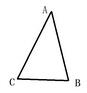
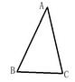
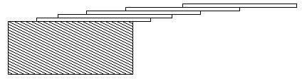

# 9.思维的体操   

[TOC]   

## A*B   
>**Description:** 设计一个程序求出A*B，然后将其结果每一位相加得到C，如果C的位数大于等于2，继续将C的各位数相加，直到结果是个一位数k。例如：6*8=484+8=121+2=3输出3即可。   
>**Input:** 输入给出两个非负整数m，n（0≤m，n≤1000000000000)。   
>**Output:** 输出k。   
>**Sample Input:** 1234567 67   
>**Sample Output:** 4   


## Easy problem   
>**Description:** When Tom was a child , he was always thinking about some simple math problems ,such as “What it’s 1 cup of water plus 1 pile of dough ..” , “100 yuan buy 100 pig” .etc..One day Tom met a old man in his dream , in that dream the man whose name was“RuLai” gave Tom a problem :Given an N , can you calculate how many ways to write N as i * j + i + j (0 < i <= j) ?Tom found the answer when N was less than 10…but if N get bigger , he found it was too difficult for him to solve.Well , you clever Cers ,could you help little Tom to solve this problem and let him have a good dream ?   
>**Input:** each line contain an integer N (0<=N <= 100000000000).   
>**Output:** For each case, output the number of ways in one line   
>**Sample Input:** 11   
>**Sample Output:** 2   

```C
# include <stdio.h>
# include <math.h>

int main() {
    int number = 0;
    int count = 0;

    scanf("%d", &number);

    int i = 0;
    for (i = 2; i <= sqrt(number + 1); i++) {
        if ((number + 1) % i == 0) {
            count++;
        }
    }
    printf("%d\n", count);

    return 0;
}
```


## Hailstone   
>**Description:** Problems in Computer Science are often classified as belonging to a certain class of problems (e.g.,NP,Unsolvable,Recursive).In this problem you will be analyzing a property of an algorithm whose classification is not known for all possible inputs.Consider the following algorithm:     1.      input n    2.      print n    3.      if n = 1 then STOP    4.           if n is odd then n <- 3n + 1    5.           else n <- n / 2    6.      GOTO 2Given the input 22, the following sequence of numbers will be printed 22 11 34 17 52 26 13 40 20 10 5 16 8 4 2 1 It is conjectured that the algorithm above will terminate (when a 1 is printed) for any integral input value. Despite the simplicity of the algorithm, it is unknown whether this conjecture is true. It has been verified, however, for all integers n such that 0 < n < 1,000,000 (and, in fact, for many more numbers than this.) Given an input n, it is possible to determine the number of numbers printed (including the 1). For a given n this is called the cycle-length of n. In the example above, the cycle length of 22 is 16. For any two numbers i and j you are to determine the maximum cycle length over all numbers between i and j.    
>**Input:** The input will consist of a series of pairs of integers i and j, one pair of integers per line. All integers will be less than 1,000,000 and greater than 0.    
>**Output:** For each pair of input integers i and j you should output i, j, and the maximum cycle length for integers between and including i and j. These three numbers should be separated by at least one space with all three numbers on one line and with one line of output for each line of input. The integers i and j must appear in the output in the same order in which they appeared in the input and should be followed by the maximum cycle length (on the same line).    
>**Sample Input:** 1 10   
>**Sample Output:** 1 10 20   


## The Ratio of gainers to losers   
>**Description:** If you ever see a televised report on stock market activity, you'll hear the anchorperson say something like ``Gainers outnumbered losers 14 to 9,'' which means that for every 14 stocks that increased in value that day, approximately 9 other stocks declined in value. Often, as you hear that, you'll see on the screen something like this:Gainers 1498Losers 902As a person with a head for numbers, you'll notice that the anchorperson could have said ``Gainers outnumbered losers 5 to 3'', which is a more accurate approximation to what really happened. After all, the exact ratio of winners to losers is (to the nearest millionth) 1.660754, and he reported a ratio of 14 to 9, which is 1.555555, for an error of 0.105199; he could have said ``5 to 3'', and introduced an error of only 1.666667-1.660754=0.005913. The estimate ``5 to 3'' is not as accurate as ``1498 to 902'' of course; evidently, another goal is to use small integers to express the ratio. So, why did the anchorperson say ``14 to 9?'' Because his algorithm is to lop off the last two digits of each number and use those as the approximate ratio.What the anchorman needs is a list of rational approximations of increasing accuracy, so that he can pick one to read on the air. Specifically, he needs a sequence {a_1, a_2, ..., a_n} where a_1 is a rational number with denominator 1 that most exactly matches the true ratio of winners to losers (rounding up in case of ties), a_{i+1} is the rational number with least denominator that provides a more accurate approximation than a_i, and a_n is the exact ratio, expressed with the least possible denominator. Given this sequence, the anchorperson can decide which ratio gives the best tradeoff between accuracy and simplicity.For example, if 5 stocks rose in price and 4 fell, the best approximation with denominator 1 is 1/1; that is, for every stock that fell, about one rose. This answer differs from the exact answer by 0.25 (1.0 vs 1.25). The best approximations with two in the denominator are 2/2 and 3/2, but neither is an improvement on the ratio 1/1, so neither would be considered. The best approximation with three in the denominator 4/3, is more accurate than any seen so far, so it is one that should be reported. Finally, of course, 5/4 is exactly the ratio, and so it is the last number reported in the sequence.Can you automate this process and help the anchorpeople?    
>**Input:** input contains one pair of positive integers. Each pair is on a line by itself, beginning in the first column and with a space between the two numbers. The first number of a pair is the number of gaining stocks for the day, and the second number is the number of losing stocks for the day. The total number of stocks never exceeds 5000.    
>**Output:** For each input pair, the standard output should contain a series of approximations to the ratio of gainers to losers. The first approximation has '1' as denominator, and the last is exactly the ratio of gainers to losers, expressed as a fraction with least possible denominator. The approximations in between are increasingly accurate and have increasing denominators, as described above.   
>**Sample Input:** 5 4   
>**Sample Output:** 1/1
4/3
5/4   


## 三点顺序   
>**Description:** 现在给你不共线的三个点A、B、C的坐标，它们一定能组成一个三角形，你需要判断A、B、C是顺时针给出的还是逆时针给出的？如图为顺时针给出如图为逆时针给出   
>   
   
>**Input:** 输入6个整数x1,y1,x2,y2,x3,y3分别表示A、B、C三个点的横纵坐标。（坐标值都在0到10000之间）   
>**Output:** 如果这三个点是顺时针给出的，请输出1，逆时针给出则输出0   
>**Sample Input:** 0 0 1 1 1 3   
>**Sample Output:** 0   

```C
# include <stdio.h>

int main() {
    int x1, y1, x2, y2, x3, y3;
    scanf("%d %d %d %d %d %d", &x1, &y1, &x2, &y2, &x3, &y3);
    int vector_area = (x2 - x1) * (y3 - y1) - (y2 - y1) * (x3 - x1);
    if (vector_area > 0) {
        printf("0");
    } else {
        printf("1");
    }

    return 0;
}
```


## 不屈的小蜗   
>**Description:** 传说中能站在金字塔顶的只有两种动物，一种是鹰，一种是蜗牛。比奇堡的小蜗听了这个传说后，大受鼓舞，立志要去爬上金字塔。为了实现自己的梦想，小蜗找到了老鹰，老鹰告诉它金字塔高H米，小蜗牛知道：白天自己能向上爬10米，但由于晚上要休息，自己会下滑5米。它想知道自己在第几天能站在金字塔顶，你帮他写个程序吧。   
>**Input:** 输入一个整数H（0<H<1000000000）代表金字塔的高度。   
>**Output:** 输出一个整数n表示小蜗第n天站在金字塔顶上。   
>**Sample Input:** 1000   
>**Sample Output:** 199   

```C
# include <stdio.h>

int main() {
    int height;
    scanf("%d", &height);
    int days = (height - 10) / 5 + 1;
    printf("%d\n", days);
    return 0;
}
```

## 公园喷水器   
>**Description:** 现有一块草坪，长为20米，宽为2米，要在横中心线上放置半径为Ri的喷水装置，每个喷水装置的效果都会让以它为中心的半径为实数Ri(0<Ri<15)的圆被湿润，这有充足的喷水装置i（1<i<600)个，并且一定能把草坪全部湿润，你要做的是：选择尽量少的喷水装置，把整个草坪的全部湿润。   
>**Input:** 第1行输入一个整数n，表示共有n个喷水装置。第2行有n个实数Ri，Ri表示该喷水装置能覆盖的圆的半径。   
>**Output:** 输出所用装置的个数   
>**Sample Input:** 5
2 3.2 4 4.5 6   
>**Sample Output:** 2   

```C
# include <stdio.h>
# include <stdlib.h>
# include <math.h>

int compare(const void *a, const void *b) {
    float a_float = *(float *)a;
    float b_float = *(float *)b;
    if (a_float > b_float) return 0;
    else return 1;
}

int main() {
    int total = 0;
    scanf("%d", &total);
    int i = 0;
    float spray[600] = {0};
    for (i = 0; i < total; i++) {
        scanf("%f", &spray[i]);
    }

    qsort(spray, total, sizeof(float), compare);

    float length = 20.0;
    float temp = 0.0;
    i = 0;
    while (length > temp) {
        temp += 2 * sqrt(spray[i] * spray[i] - 1);
        i++;
    }
    printf("%d\n", i);
    return 0;
}
```


## 勇闯天涯   
>**Description:** 进行一次勇闯天涯帆船冒险活动。帆船可以在港口租到，并且之间没有区别。一条帆船最多只能乘坐两个人，且乘客的总重量不能超过帆船的最大承载量。我们要尽量减少这次活动中的花销，所以要找出可以安置所有旅客的最少的帆船条数。现在请写一个程序，读入帆船的最大承载量、旅客数目和每位旅客的重量。根据给出的规则，计算要安置所有旅客必须的最少的帆船条数，并输出结果。   
>**Input:** 第1行包括两个整数w，n，80≤w≤200,1≤n≤300，w为一条帆船的最大承载量，n为人数。   
>**Output:** 每组人数所需要的最少帆船的条数。   
>**Sample Input:** 85 6
5 84 85 80 84 83   
>**Sample Output:** 5   


## 寻找规律   
>**Description:** 小鹏在小学时最喜欢上数学课。有一次上课，数学老师布置了一道题目：给出一组有规律的整数，而且只给出前5项，求出后面5项。比如：1，2，3，4，5，□，□，□，□，□。显然这是等差数列，所以答案应该是6，7，8，9，10。老师规定规律只有三种：等差数列、等比数列、斐波那契数列（f[i]=f[i-2]+f[i-1]）；且公差、公比均为整数，所有出现的数字不会超出int范围。聪明的你，来比一比你和小鹏谁算的快。   
>**Input:** 每行5个整数，代表题目给出的前5项，用空格分隔。   
>**Output:** 如果能找到符合条件的规律，则输出5个整数，代表后5项的值。否则，请输出NULL   
>**Sample Input:** 2 3 5 8 13   
>**Sample Output:** 21 34 55 89 144   


## 延伸的卡片   
>**Description:** 你能使一叠在桌子上的卡片向外伸出多远？如果你有一个卡片，这张卡片最多可以向桌子外伸出卡片的一半长度（假设该卡片必须垂直于桌子），如果有两个卡片，就可以让上面的卡片向外伸出下面那张卡片的一半长度，而下面那张卡伸出桌子卡片的三分之一长度，所以两张卡片总的向外延伸1/2 + 1/3 = 5/6卡长度。以此类推，N张卡片向外延伸1/2+1/3+1/4+…+1/（n +1）卡片长度，最上面的向外延伸1/2，第二张向外延伸1/3，第三张向外延伸1/4，…，最下面一张向外延伸1 /（n +1）。如下图所示。   
>   
>**Input:** 每个测试数据是一个3位正浮点数c，最小值为0.01，最大值为5.20。   
>**Output:** 输出卡片的最小数目，为整型。   
>**Sample Input:** 1.5   
>**Sample Output:** 6   

```C
# include <stdio.h>
# include <stdlib.h>

int main() {
    float length;
    int number = 1;
    scanf("%f", &length);
    float temp = 0.0;
    while ((length - temp) > 1e-6) {
        temp += 1 / (number * 1.0 + 1.0);
        number++;
    }
    printf("%d\n", number - 1);
}
```


## 操场训练   
>**Description:** 在一个划分成网格的操场上，n个士兵散乱地站在网格点上。网格点由整数坐标(x,y)表示。士兵们可以沿网格边上、下、左、右移动一步，但在同一时刻任一网格点上只能有一名士兵。按照军官的命令，士兵们要整齐地列成一个水平队列，即排列成(x,y),(x+1,y),…,(x+n-1,y)。如何选择x 和y的值才能使士兵们以最少的总移动步数排成一列。计算使所有士兵排成一行需要的最少移动步数。   
>**Input:** 第1行输入士兵数n，1≤n≤10000。接下来n行是士兵的初始位置，每行2个整数x和y，-10000≤x，y≤10000。   
>**Output:** 输出士兵排成一行需要的最少移动步数。   
>**Sample Input:** 5
1 2
2 2
1 3
3 -2
3 3   
>**Sample Output:** 8   


## 最长回文子串   
>**Description:** 输入一个字符串，求其中最长回文子串。子串的含义是：在字符串中连续出现的字符串片段。回文的含义是：正着看和倒着看是相同的，如abba和abbebba。在判断时要求忽略所有的标点和空格，且忽略大小写，但输出时按原样输出（首尾不要输出多余的字符串）。输入字符串长度大于等于1小于等于5000，且单独占一行。   
>**Input:** 输入一行字符串。   
>**Output:** 输出所要求的回文子串。   
>**Sample Input:** Last Week,todo level odot,King   
>**Sample Output:** k,todo level odot,K   


## 王的对抗   
>**Description:** 从前有两个国家A和B。两国都是兵强马壮，国王更是威猛无比。这两个国家要争取一片金矿，都不想放弃，由于两个国家的国王都是仁爱的，害怕劳民伤财不想打仗，于是便有了个决定，决定分别派出n个人来进行比赛POJ刷题。国王们都知道田忌赛马这件事，于是出场的顺序都是从弱到强；每胜一场得2分，平一场得1分，输一场得0分；因为他们都不相信对方国家的人，于是就想让你来当裁判，你一定能做到，是吗？   
>**Input:** 第1行有一个整数n（1<n<100），紧随着两行，每行有n个数分别代表有A和B国家的参赛人员的水平，数据保证都在int范围内，用空格隔开。   
>**Output:** 如果两国之间的分数相等，则输出=，输出胜的一方（A或B或=）;   
>**Sample Input:** 5
1 2 3 4 5
2 7 1 1 2   
>**Sample Output:** A   

```C
# include <stdio.h>
# include <stdlib.h>

int compare(const void *a, const void *b) {
    return (*(int*)a - *(int*)b);
}

int main() {
    int total;
    int a[100];
    int b[100];
    scanf("%d", &total);
    int i = 0;
    for (; i < total; i++) {
        scanf("%d", &a[i]);
    }
    for (i = 0; i < total; i++) {
        scanf("%d", &b[i]);
    }

    qsort(a, total, sizeof(int), compare);
    qsort(b, total, sizeof(int), compare);

    int a_score = 0;
    int b_score = 0;

    for (i = 0; i < total; i++) {
        if (a[i] > b[i]) {
            a_score += 2;
            b_score += 0;
        } else if (a[i] == b[i]) {
            a_score += 1;
            b_score += 1;
        } else {
            a_score += 0;
            b_score += 2;
        }
    }

    if (a_score > b_score) {
        printf("A");
    } else if (a_score == b_score) {
        printf("=");
    } else {
        printf("B");
    }

    return 0;

}

```

## 路痴   
>**Description:** 路痴一旦不高兴，就必然一个人漫无目的的出去走走。今天被老师训了，他又不高兴了，怎么办？那就出去走呗，反正丢不了。这次幸好记下出来时的方向，并且在一张纸上密密麻麻的记下了他拐的弯（每次拐的弯都是90度的弯），0代表左拐，1代表右拐，那么多0、1，他实在看不下去了，正好遇见聪明的你，你能告诉他，他现在面向哪吗？   
>**Input:** 第1行输入他开始时的面对方向，和他拐弯次数n（0<n<100）。   
>**Output:** 他现在所面向的方向(West、East、North、South)   
>**Sample Input:** East 6
0 0 0 0 0 0   
>**Sample Output:** West   

```C
# include <stdio.h>
# include <string.h>

// 定义方向
const char directions[][6] = {
    "North",
    "South",
    "West",
    "East"
};

int main() {
    char direction[6] = "\0";
    int total = 0;
    int turn[100];
    scanf("%s %d", direction, &total);
    int i = 0;
    for (i = 0; i < total; i++) {
        scanf("%d", &turn[i]);
    }
    
    // 采用双层if-else嵌套实现方向状态机
    for (i = 0; i < total; i++) {
        if (strcmp(direction, directions[0]) == 0) {
            if (turn[i] == 0) {
                strcpy(direction, directions[2]);
            } else if (turn[i] == 1) {
                strcpy(direction, directions[3]);
            }
        } else if (strcmp(direction, directions[1]) == 0) {
            if (turn[i] == 0) {
                strcpy(direction, directions[3]);
            } else if (turn[i] == 1) {
                strcpy(direction, directions[2]);
            }
        } else if (strcmp(direction, directions[2]) == 0) {
            if (turn[i] == 0) {
                strcpy(direction, directions[1]);
            } else if (turn[i] == 1) {
                strcpy(direction, directions[0]);
            }
        } else if (strcmp(direction, directions[3]) == 0) {
            if (turn[i] == 0) {
                strcpy(direction, directions[0]);
            } else if (turn[i] == 1) {
                strcpy(direction, directions[1]);
            }
        }
    }

    printf("%s\n", direction);
    return 0;
}
```


## 阶乘合计   
>**Description:** 假定一个非负数整数n，判断n是不是一些数（这些数不允许重复使用，且为正数）的阶乘之和，如9=1!+2!+3!，如果是，则输出YES，否则输出NO；   
>**Input:** 输入一个正整数n<1000000   
>**Output:** 如果符合条件，输出YES，否则输出NO   
>**Sample Input:** 840   
>**Sample Output:** YES   


